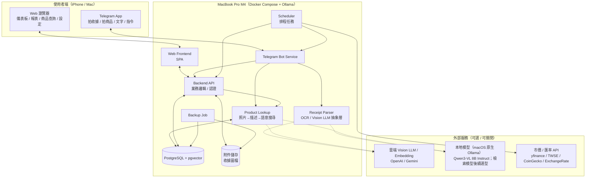
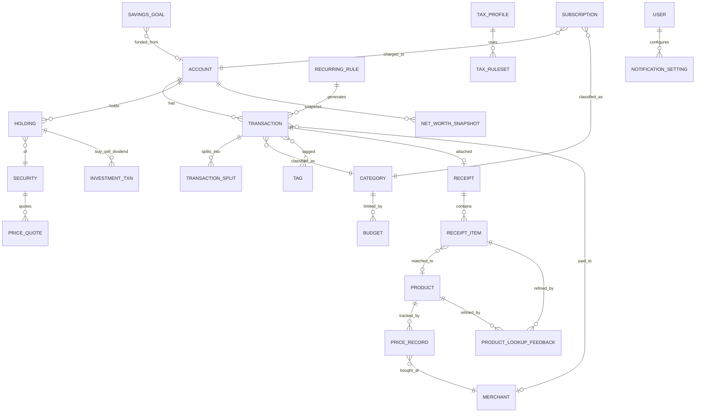

# 個人財務管理系統 — 需求框架文件

| 項目 | 內容 |
|---|---|
| 文件版本 | v0.5（草稿；圖表呈現、報表匯出與本機 AI 規劃已確認） |
| 建立日期 | 2026-09-22 |
| 最後更新 | 2026-09-24（v0.5：確認 M4 Pro / 24 GB，採原生 Ollama + Qwen3-VL 8B Instruct；沿用 v0.4 Web／匯出／Notion 決策） |
| 狀態 | 🟡 整體需求討論中；§1.6、§2.5.1 與 Q6／Q17 為已確認決策，其餘待確認事項仍見 §9 |
| 部署環境 | MacBook Pro（Apple M4 Pro / 24 GB）本地端自架；資料庫與附件主副本存本機，外部服務資料流向見 §1.6 與 §3 |
| 使用裝置 | iPhone（Telegram / Safari） |
| 開發方式 | 由 AI Coding Agent（OpenAI Codex / Claude Code）依本系列文件實作 |
| 後續文件 | 02-architecture.md、03-data-model.md、04-dev-plan.md、AGENTS.md（定案後撰寫） |

---

## 1. 專案概述

### 1.1 專案目標
建立一套 **自架（self-hosted）、隱私優先** 的個人財務管理系統，整合 **記帳、資產、投資、預算目標、稅務試算、物價追蹤** 六大面向，並透過 **Telegram Bot** 達到「拍照即記帳」的快速輸入體驗，搭配 **Web 儀表板** 進行分析與報表檢視，以及 **每日推播通知** 掌握花費狀況。

### 1.2 核心價值
1. **快速**：3 秒內完成一筆記帳（拍收據 / 傳文字 / 語音）。
2. **完整**：收入、支出、資產、負債、投資一站管理。
3. **洞察**：自動分析花費趨勢、投資損益、物價變化。
4. **規劃**：由目標反推每日 / 每月應存金額，並試算稅金。
5. **私有**：財務資料庫與附件主副本存放在自家電腦；Telegram 訊息會經第三方服務，AI 辨識可切換本地 / 雲端，Notion 摘要同步預設關閉。

### 1.3 使用者與環境
- 主要使用者：專案擁有者本人（單一使用者為主，預留多使用者/家庭帳本擴充）。
- 主機：**MacBook Pro（Apple M4 Pro，24 GB 統一記憶體；2026-09-24 實機確認）**
  - 已選 macOS 原生 Ollama + Qwen3-VL 8B Instruct 作為本機收據辨識；AI 僅填草稿，人工核對後才入帳。
  - 容器：Docker Desktop for Mac 或 OrbStack（較省資源）。
  - 排程 / 常駐：需注意 **筆電睡眠** 會中斷排程；解法見 §3 非功能需求。
- 手機：**iPhone**
  - 主要入口：Telegram App。
  - 次要入口：Safari 開啟 Web（RWD / PWA 加到主畫面）。
  - 可選加值：iOS 捷徑（Shortcuts）+ 分享選單 → 直接把照片 / 截圖丟給系統 API（P2）。

### 1.4 開發方式（AI Coding Agent）
專案將由 **OpenAI Codex / Claude Code** 依文件實作，因此本系列文件需滿足：
- 需求以 **ID 編號**（如 `T-01`）可被逐項引用與驗收。
- 定案後補充 `AGENTS.md`（Codex）與 `CLAUDE.md`（Claude Code）：說明技術棧、目錄約定、指令（啟動 / 測試 / 遷移）、程式風格、禁止事項。
- `04-dev-plan.md` 將以「可獨立交付的小任務」切分，每個任務附驗收條件，方便 Agent 逐步執行與人工檢查。

### 1.5 範圍界定（Out of Scope，第一版不做）
- 銀行帳戶自動同步（美國 Plaid / 台灣 Open Banking）— 列為未來選項。
- 正式報稅申報檔案產出（僅做「試算」，不取代報稅軟體）。
- 多人協作 / 權限管理（第一版單一使用者）。
- 原生 iOS / Android App（以 Telegram + RWD Web 取代）。
- 原生 `.numbers` / `.pages` / `.key` 檔案產生器、Numbers 或 Notion 與本機帳本的雙向同步（見 §1.6）。

### 1.6 已確認決策：圖表呈現、報表匯出與 Notion（2026-09-23）

**採用「Web 儀表板為主，Numbers / PDF 單向匯出為輔，Notion 後續按需同步摘要」的方案。** 此決策應沿用至架構、資料模型、開發計畫與驗收；不因另有匯出或同步功能而省略 Web 儀表板。

| 通道 | 定位 | 資料更新與操作界線 |
|---|---|---|
| Web 儀表板 | 日常查看收支、預算、淨資產、商品價格與交易明細的主要介面 | 直接讀取本機後端；透過系統介面修改帳本，支援 Mac 瀏覽器與 iPhone Safari |
| Apple Numbers | 開啟匯出資料，進行離線分析、自由試算及個人調整 | 以 `.xlsx` / `.csv` 交付當時的資料快照；在 Numbers 的修改不自動回寫本機帳本 |
| PDF | 固定版面的月報 / 年報、圖表留存與列印 | 靜態快照；資料改變後需重新匯出，既有檔案不自動更新 |
| Notion（P2，可選） | 月度摘要、目標進度與心得筆記 | 僅由本機系統單向同步選定摘要；預設停用，不作為核心帳本，也不回寫交易 |

- **唯一帳本來源**：本機 PostgreSQL 保存正式資料；Web、匯出與 Notion 摘要共用後端的報表計算規則，避免各自重寫財務公式。
- **交付順序**：先完成 Web 基本圖表與 CSV，再加入 Numbers 相容的 XLSX 及 PDF；Notion 放在後續可選階段。各模組圖表隨對應功能完成而加入，見 §8。
- **本機與雲端邊界**：Web 可在本機使用，不要求公開網站。主機開機且服務可連線時才能讀取最新資料；手機在外查看依 Q8 的遠端存取決策配置。本機檔案可離線保存，使用者若自行放入 iCloud 等同步位置，會依該服務設定上雲。
- **Notion 資料揭露**：啟用時需清楚列出將傳往 Notion 的摘要欄位；不得因安裝開發用 Notion 插件而自動啟用產品同步。Notion 關閉或不可用時，記帳、Web 與匯出仍可使用。
- **維護界線**：首版不支援 Numbers / Notion 雙向編輯同步，不維護另一套外部帳本。Apple Pages / Keynote 可供使用者自行編排報告，非本專案首版自動化輸出目標。
- **Notion 呈現方式**：不以嵌入需登入的本機 Web 作為主要方案，避免桌面 / 手機 App 的登入與嵌入相容性問題；未來採選定摘要同步，必要時附連回 Web 的連結。

---

## 2. 功能需求

> 優先級定義：**P0** = 第一版必須 ｜ **P1** = 第一版盡量完成 ｜ **P2** = 後續版本 ｜ **P3** = 構想 / 待評估

### 2.1 帳戶與資產管理（Accounts & Net Worth）

| ID | 功能 | 說明 | 優先級 |
|---|---|---|---|
| A-01 | 帳戶管理 | 建立多種帳戶：現金、銀行存款、信用卡、電子支付、證券戶、退休帳戶（401k / IRA / 勞退）、加密貨幣錢包、不動產、車輛等 | P0 |
| A-02 | 負債管理 | 信用卡欠款、房貸、車貸、學貸；記錄本金、利率、每期還款 | P0 |
| A-03 | 多幣別 | 支援 USD / TWD 及其他幣別，自動抓匯率換算成主幣別 | P0 |
| A-04 | 淨資產（Net Worth）追蹤 | 資產 − 負債，每日快照，繪製淨資產成長曲線 | P0 |
| A-05 | 帳戶對帳（Reconcile） | 輸入銀行實際餘額，系統列出差異並協助補登 | P1 |
| A-06 | 資產配置圖 | 現金 / 股票 / 債券 / 不動產 / 加密貨幣比例圓餅圖 | P1 |
| A-07 | 貸款攤還試算 | 提前還款 / 加碼還款對總利息與還清日期的影響模擬 | P2 |

### 2.2 記帳：支出 / 收入 / 轉帳（Transactions）

| ID | 功能 | 說明 | 優先級 |
|---|---|---|---|
| T-01 | 手動新增交易 | 金額、日期、帳戶、分類、子分類、商家、備註、標籤、幣別 | P0 |
| T-02 | 交易類型 | 支出 / 收入 / 帳戶間轉帳（轉帳不計入支出） | P0 |
| T-03 | 分類系統 | 兩層分類（例：飲食 → 外食 / 食材），可自訂、可設圖示與顏色 | P0 |
| T-04 | 標籤（Tags） | 跨分類的彈性標記，如「旅遊-日本2026」「報帳」「可抵稅」 | P0 |
| T-05 | 收據附件 | 每筆交易可附收據圖片，並保存原始圖檔（保固 / 退貨 / 報稅憑證） | P0 |
| T-06 | 週期性交易 | 房租、訂閱、薪資等自動產生（每日 / 週 / 月 / 年、自訂間隔） | P0 |
| T-07 | 拆帳（Split） | 一張收據拆多個分類（Costco 買了食材 + 日用品） | P1 |
| T-08 | 規則引擎自動分類 | 「商家包含 Starbucks → 分類：咖啡」等自訂規則，自動套用 | P1 |
| T-09 | 交易搜尋 / 篩選 | 依期間、金額範圍、分類、商家、標籤、關鍵字全文搜尋 | P0 |
| T-10 | 批次編輯 | 多筆交易同時改分類 / 加標籤 | P1 |
| T-11 | 匯入 CSV / OFX | 從銀行、信用卡匯出檔案匯入，含欄位對應與重複偵測 | P1 |
| T-12 | 退款 / 退貨處理 | 退款關聯原交易，正確沖銷支出 | P1 |
| T-13 | 代墊 / 分帳 | 記錄幫他人代付、待收回款項 | P2 |

### 2.3 快速記帳：Telegram Bot（Quick Capture）

| ID | 功能 | 說明 | 優先級 |
|---|---|---|---|
| B-01 | 拍照收據辨識 | 傳收據照片 → OCR / Vision LLM 解析 → 擷取商家、日期、總額、品項、稅金 → 回覆確認卡片（可一鍵確認或修改）| P0 |
| B-02 | 文字快速記帳 | 自然語言輸入，例：`午餐 250` 或 `星巴克 6.5 usd` → 自動解析金額、分類、幣別 | P0 |
| B-03 | 語音記帳 | 傳語音 → 語音轉文字（Whisper）→ 同 B-02 流程 | P2 |
| B-04 | 確認 / 修正流程 | Inline Keyboard 按鈕：✅ 確認 / ✏️ 改分類 / 🗑 刪除 / 🔀 拆帳 | P0 |
| B-05 | 快速查詢指令 | `/today` 今日花費、`/month` 本月摘要、`/networth` 淨資產、`/budget` 預算剩餘 | P0 |
| B-06 | 品項層級擷取 | 收據內每一品項（名稱、數量、單價）→ 餵入物價追蹤模組（見 2.7） | P1 |
| B-07 | 安全性 | 僅允許白名單 Telegram User ID 操作 | P0 |
| B-08 | 商家記憶 | 同商家再次出現時自動帶入上次的分類與標籤 | P1 |
| B-09 | 手動輸入待辦 | 傳 `/pending` 查看待確認收據，避免遺漏 | P1 |
| B-10 | 照片意圖判別 | 傳照片時區分「收據（記帳）」與「商品（查購買歷史，見 P-09）」：以指令 / caption（`/lookup`、`/find`）明確指定為主，未指定時由 Vision 模型判斷並詢問確認 | P0 |
| B-11 | 商品查價指令 | `/lookup 關鍵字` 或傳商品照片 → 回覆過往購買摘要（見 P-09） | P0 |

### 2.4 投資管理（Investments）

| ID | 功能 | 說明 | 優先級 |
|---|---|---|---|
| I-01 | 持股記錄 | 美股 / 台股 / ETF / 債券 / 基金 / 加密貨幣的買入、賣出、股息、股票分割 | P0 |
| I-02 | 自動更新市價 | 定時抓取收盤價（yfinance / 台灣證交所 / CoinGecko），更新市值 | P0 |
| I-03 | 損益計算 | 未實現損益、已實現損益、總報酬率、年化報酬率（XIRR / TWR） | P0 |
| I-04 | 成本基礎法 | 支援 FIFO / 平均成本法（美國稅務需 FIFO 或指定批次） | P1 |
| I-05 | 股息 / 配息追蹤 | 股息收入記錄、股息日曆、殖利率、股息成長 | P1 |
| I-06 | 定期定額（DCA）追蹤 | 自動比對計畫 vs 實際投入 | P2 |
| I-07 | 資產配置與再平衡 | 設定目標比例，計算偏離度並建議買賣金額 | P2 |
| I-08 | 績效基準比較 | 與 S&P 500 / 0050 對比 | P2 |
| I-09 | 匯率損益拆分 | 海外投資將「價格變動」與「匯率變動」損益分開顯示 | P2 |

### 2.5 分析與報表（Analytics & Reports）

| ID | 功能 | 說明 | 優先級 |
|---|---|---|---|
| R-01 | 儀表板總覽 | 今日 / 本月支出、本月收入、預算進度、淨資產、投資損益、近期交易 | P0 |
| R-02 | 期間報表 | 日 / 週 / 月 / 年 / 自訂區間 的收入、支出、結餘、收益 | P0 |
| R-03 | 分類分析 | 圓餅圖 / 樹狀圖，分類、子分類、商家 Top N | P0 |
| R-04 | 趨勢分析 | 逐月支出折線、同期比較（本月 vs 上月、今年 vs 去年） | P0 |
| R-05 | 現金流（Cash Flow） | 收入 → 支出 / 儲蓄 / 投資 的 Sankey 流向圖 | P1 |
| R-06 | 固定 vs 變動支出 | 自動區分固定支出（房租、訂閱）與變動支出，計算最低生存成本 | P1 |
| R-07 | 儲蓄率 | (收入 − 支出) / 收入，月度與年度趨勢 | P0 |
| R-08 | 異常花費偵測 | 某分類本月超出歷史平均 X% 時標示提醒 | P2 |
| R-09 | 報表匯出（總項） | 按 R-09A / B / C 分批交付；單向快照，不自動回寫帳本，詳見 §2.5.1 | 依子項 |
| R-09A | CSV 匯出 | 匯出指定期間的交易明細與基本報表彙總，供 Numbers 或其他工具分析；CSV 不包含圖表或版面格式 | P0 |
| R-09B | Numbers 相容 XLSX 匯出 | 交易明細、分類彙總、月度收支等工作表，含基本格式與圖表；需在實際 Numbers 中驗收 | P1 |
| R-09C | PDF 報表匯出 | 月報 / 年報的指標、圖表、摘要與必要註記，固定版面供離線留存及列印 | P1 |
| R-10 | 日曆熱力圖 | 以日曆呈現每日花費強度 | P2 |
| R-11 | 年度回顧（Year in Review） | 年度花費總結、最大單筆、最常去商家、儲蓄率變化 | P2 |
| R-12 | 共用報表計算與一致性 | Web、CSV、XLSX、PDF 及後續 Notion 摘要共用後端報表服務；記錄期間、篩選條件、幣別、時區、資料截至時間與計算規則版本 | P0 |
| R-13 | Notion 摘要單向同步 | 後續可選：同步月度收入、支出、儲蓄率及選定目標進度，顯示更新時間；不傳完整交易與收據、不回寫帳本 | P2 |

#### 2.5.1 圖表與匯出的實作規格及驗收條件

**Web 圖表**

- 使用一套成熟圖表套件及共用元件，先依序交付：每月收入 / 支出 / 結餘、分類支出、淨資產趨勢；預算進度於 Phase 3 加入，商品歷史單價於 Phase 5 加入。
- 支援期間、分類及帳戶等適用篩選；分類圖表可連到保留同一組篩選條件的交易明細。幣別、單位、日期範圍與資料截至時間必須清楚標示。
- 手機操作不依賴滑鼠 hover；以觸控或文字明細取得數值。無資料、載入中、載入失敗與資料過期需各有明確狀態，缺資料不冒充為零。

**共用計算與快照（R-12）**

- 由 `analytics` 提供統一的報表資料；前端、匯出器與 Notion 同步只負責呈現或傳送，不另行定義收入、支出、轉帳、退款、匯率或儲蓄率公式。
- 同一資料快照、期間、篩選條件、幣別、時區及規則版本下，各通道的對應數值與捨入結果必須一致。匯出期間發生新交易時，檔案仍使用同一快照，避免明細與合計取自不同時點。
- XLSX / PDF 附報表資訊；CSV 交易與彙總檔案附同批次 metadata 檔；Notion 摘要顯示報表期間與資料截至 / 最近成功同步時間。已月結期間須標明採用的月結快照版本。
- Numbers 可供使用者額外試算，但匯出檔中的正式指標必須已有後端算出的結果，不依賴 Numbers 開啟後才重算。

**匯出規格（R-09A / B / C）**

- CSV：UTF-8，保留繁體中文、備註、明確日期及幣別；正確處理逗號、引號與換行。匯出到試算表的使用者輸入文字須防止被解讀為公式，金額欄仍維持正確的數字型別。
- XLSX：至少有「報表資訊」「交易明細」「分類彙總」「月度收支」工作表；使用 Numbers 可讀取的基本格式、簡單圖表與明確欄位型別，不依賴巨集、外部資料連結或 Excel 專用進階功能。不直接產生 `.numbers` 檔案。
- PDF：由同一份報表資料產生固定版面，包含標題、期間、幣別、生成 / 資料截至時間及圖表；繁體中文字型正常，跨頁表格有表頭，無裁切或重疊。R-09C 是基本月報 / 年報，R-11 的進階年度回顧仍維持 P2。
- 匯出遵守登入與資料存取權限，不產生預設公開連結；不包含 API Key、Token 或非使用者選取範圍的資料。
- R-09 系列是可篩選的報表匯出；E-08 仍負責全量 CSV / JSON 資料可攜性，E-07 負責資料庫與附件備份。報表檔案不取代完整備份。

**Notion 同步規格（R-13，後續才實作）**

- 預設關閉；啟用時選定目的頁面 / 資料庫與摘要欄位。允許的資料為月度收入、支出、儲蓄率、選定目標的彙總進度及報表資訊，不同步交易明細、商家清單、帳戶明細、收據原圖或憑證。
- 以穩定的報表 / 目標識別碼更新既有摘要，重跑或重試不新增重複頁面；同步錯誤可重試並顯示最後成功時間，失敗不阻擋記帳或 Web 使用。
- 系統管理的摘要欄位在下次同步以本機結果更新；使用者心得筆記放在獨立區域，不覆寫。Notion 的修改或刪除不回寫本機帳本；本機來源已刪除或停用的摘要須在下次同步標記失效或封存，保留使用者筆記。
- Notion API 金鑰使用本機機密設定；無金鑰也能啟動核心系統。接入時再確認方案限制與 API 相容性。

**驗收案例**

| ID | 情境 | 通過條件 |
|---|---|---|
| RV-01 | 使用虛構帳本，包含收入、支出、退款及帳戶間轉帳 | 同一快照與條件下，Web、CSV、XLSX、PDF 的對應指標符合事先定義的預期值，且通道間一致；Notion 啟用後納入同一檢查 |
| RV-02 | 圖表切換月份、帳戶與分類，並查看明細 | 圖表、合計、明細及匯出使用相同條件；無資料時顯示空狀態 |
| RV-03 | 在 Mac 的實際 Numbers 開啟 CSV / XLSX 樣本 | 繁中、日期、金額及幣別正確；XLSX 工作表與基本圖表可用，無未處理的相容性警告；記錄驗收時 Numbers 版本；無法實測時須標示未驗證 |
| RV-04 | 修改 Numbers 中的交易金額 | 本機帳本與 Web 不變；重新匯出的新檔案仍以本機正式資料為準 |
| RV-05 | 匯出跨頁 PDF，以及同期間的不同幣別報表 | 字型、頁面、圖例、單位與合計正常，無重疊或裁切；每份檔案清楚標明所用幣別 |
| RV-06 | iPhone Safari 實際操作圖表，並模擬後端無法連線 | 觸控可查數值與明細；連線失敗時顯示狀態，不將舊資料標示為最新 |
| RV-07 | Notion 關閉、無金鑰、同步失敗及重複重試 | 核心系統仍正常；重試不產生重複摘要，僅傳允許欄位並顯示最近成功時間 |
| RV-08 | Notion 修改摘要、加入心得，之後重新同步 | 修改不回寫帳本；系統摘要更新、心得保留，失效摘要不繼續冒充有效資料 |

**參考依據（2026-09-23 查閱）**

- [Apple：Numbers 匯入 Excel 與文字檔](https://support.apple.com/guide/numbers/import-an-excel-or-text-file-tan9f3c54bdc/mac)；格式支援不等於所有 Excel 功能皆相容，仍需 RV-03 實測。
- [Notion：圖表功能](https://www.notion.com/help/charts)；圖表與方案限制於實際接入時重新確認。
- [Notion：嵌入內容](https://www.notion.com/help/embed-and-connect-other-apps)；需登入外部網站的嵌入內容存在桌面 / 手機 App 限制，因此不作為主要財務介面。

### 2.6 預算與目標規劃（Budget & Goals）

| ID | 功能 | 說明 | 優先級 |
|---|---|---|---|
| G-01 | 分類預算 | 每月各分類預算上限，即時顯示已用 / 剩餘 / 進度條 | P0 |
| G-02 | 儲蓄目標（Piggy Bank） | 設定目標金額 + 期限（例：2027/06 前存 $20,000 買車）| P0 |
| G-03 | 反推每日 / 每月需存金額 | 依目標金額、期限、現有進度、預期報酬率 → 計算每日 / 每週 / 每月應存多少，並顯示達成率與預估完成日 | P0 |
| G-04 | 目標可行性分析 | 比對歷史平均收支，若目標不可行則建議：延長期限 / 削減哪些分類 | P1 |
| G-05 | 預算超支預警 | 達 80% / 100% 推播提醒 | P0 |
| G-06 | 支出節奏（Pace）提醒 | 依「本月剩餘天數 vs 剩餘預算」判斷花費過快 | P1 |
| G-07 | 預算滾存（Rollover） | 上月未用完預算可累積至下月（信封制） | P2 |
| G-08 | 緊急預備金追蹤 | 依月固定支出 × N 個月計算目標，顯示目前覆蓋月數 | P1 |
| G-09 | FIRE / 退休試算 | 依目前資產、儲蓄率、報酬率，估算財務自由所需年數；依 4% 法則（年支出 × 25）自動計算 FIRE Number，支出基準可選「近 12 個月實際」或「自訂退休生活預算」；詳見 C-05 | P1 |
| G-10 | 多目標排序 | 多個目標同時進行時的資金分配優先順序 | P2 |

### 2.7 常購物品與物價追蹤（Price Tracker）

| ID | 功能 | 說明 | 優先級 |
|---|---|---|---|
| P-01 | 物品主檔 | 建立常購品項（雞蛋、牛奶、汽油、咖啡豆…），設定單位（顆 / L / 加侖 / kg） | P0 |
| P-02 | 價格記錄 | 每次購買記錄：日期、商店、單價、數量、單位價格（自動換算） | P0 |
| P-03 | 收據自動比對 | 由 B-06 擷取的品項模糊比對到物品主檔（可手動確認對應） | P1 |
| P-04 | 價格趨勢圖 | 單品價格歷史折線圖，顯示漲跌幅 %、最高 / 最低 / 平均 | P0 |
| P-05 | 跨商店比價 | 同品項在不同商店的最新價格與歷史最低價 | P1 |
| P-06 | 漲價提醒 | 品項價格較上次 / 較 3 個月平均上漲超過 X% 時通知 | P1 |
| P-07 | 個人通膨指數 | 以自己常購籃子計算「我的 CPI」 | P2 |
| P-08 | 購買頻率預測 | 依歷史間隔預測下次需購買日期（補貨提醒） | P2 |
| **P-09** | **相似商品購買歷史查找（購物前查價）** | 想買某商品時，**拍商品照片** 或 **輸入關鍵字**，系統找出過往所有買過的相似商品（**不限日期、不限商店**），顯示每次購買的金額與摘要，讓使用者知道該類商品過去花了多少。詳見 §2.7.1 | **P0** |
| P-10 | 查找結果回饋學習 | 使用者可標記「這筆不相關」或「合併為同一商品」，修正比對並提升下次準確度 | P1 |

#### 2.7.1 P-09 相似商品購買歷史查找 — 詳細規格

**使用情境**
> 在超市看到一款洗衣精，想知道「我以前買過類似的嗎？花多少？」→ 打開 Telegram 拍照（或輸入「洗衣精」）→ 3~10 秒內收到：過去買過 5 次洗衣精，總共 $62.5，最低 $9.99（Costco, 2025-11），最高 $14.5（Target, 2026-03），最近一次 $12.99（2026-08）。

**輸入方式**
| 通道 | 方式 |
|---|---|
| Telegram | `/lookup 洗衣精`；或傳商品照片並加 caption `/lookup`（無 caption 時觸發 B-10 意圖判別） |
| Web | 「商品查詢」頁：搜尋框輸入關鍵字，或上傳 / 拖曳照片 |
| iOS 捷徑（P2） | 分享選單 → 傳照片至系統 API |

**處理流程**
1. **照片 → 商品描述**：Vision LLM 從照片擷取 `{品名, 品牌, 品類, 規格/容量, 關鍵特徵}`（例：「Tide 洗衣精 液態 92oz」）。關鍵字輸入則跳過此步。
2. **查詢正規化**：LLM 或規則產生多語同義詞（洗衣精 / laundry detergent / Tide / 洗衣液），並抽出品類。
3. **語意比對（不限日期、不限商店）**：以 **向量嵌入（Embedding）語意搜尋** + **關鍵字全文搜尋** 混合檢索，比對範圍：
   - `Product` 物品主檔（名稱、別名、品類）
   - `ReceiptItem` 收據品項（OCR 原始名稱，如 `TIDE HE 92OZ`）
   - `Transaction` 備註 / 商家（無收據明細的手動記帳）
4. **結果分級**：依相似度分為「相同商品」「同品類相似商品」，可調門檻；低於門檻不顯示。
5. **輸出摘要**：
   - 統計：購買次數、總花費、平均 / 最低 / 最高單價（含商店與日期）、最近一次購買、價格趨勢（↑↓%）
   - 明細清單：日期、商店、品名（OCR 原文）、數量、單價、總價、幣別（換算主幣別）
   - 可點擊回到該筆交易 / 收據原圖
6. **回饋**：Telegram Inline Keyboard「✅ 正確 / ❌ 排除某筆 / 🔗 合併為同一商品 / ➕ 建立為常購物品」（對應 P-10）。

**技術要點**
- Embedding 模型可切換：本地 `bge-m3`（多語、中英混合佳）/ `nomic-embed-text` via Ollama；雲端 OpenAI `text-embedding-3-small`。
- 向量儲存：PostgreSQL **pgvector** 擴充（免額外服務）。
- 每筆 `Product` / `ReceiptItem` / `Transaction` 建立或修改時，非同步產生 embedding 並存入。
- 照片本身不需長期保存（可選擇保存至 Wishlist / 願望清單 E-03 作為候選商品）。

**驗收條件**
- 輸入「牛奶」可找到 OCR 品名為 `ORGANIC WHOLE MILK 1GAL`、`鮮乳 1858ml` 等記錄。
- 拍一張咖啡豆包裝照片，可找到過去在不同商店購買的咖啡豆記錄並顯示金額統計。
- 查詢回應時間：關鍵字 < 3 秒；照片 < 10 秒（雲端 Vision）/ < 30 秒（本地 Vision）。

### 2.8 稅務試算（Tax Estimator）

| ID | 功能 | 說明 | 優先級 |
|---|---|---|---|
| X-01 | 美國聯邦所得稅試算 | 依報稅身分（Single / MFJ / HoH）、W-2 收入、標準 / 列舉扣除、稅率級距 → 估算應納稅額與有效稅率 | P0 |
| X-02 | 美國資本利得稅 | 由投資模組自動彙整短期 / 長期資本利得、股息（Qualified / Ordinary） | P0 |
| X-03 | 美國州稅 | 依所在州設定（可先支援 1 個州，規則檔可擴充；無所得稅州直接為 0） | P1 |
| X-04 | FICA / 預扣比對 | 依薪資單記錄的預扣稅額 vs 估算應納稅 → 預估退稅 / 補稅金額 | P1 |
| X-05 | 台灣綜合所得稅試算 | 免稅額、標準 / 列舉扣除額、特別扣除額、級距（輔助） | P1 |
| X-06 | 稅務相關交易標記 | 可抵稅支出（捐款、醫療、教育）、可扣抵項目以標籤標記並自動加總 | P1 |
| X-07 | 稅率規則以設定檔管理 | 每年稅率 / 級距 / 扣除額以 JSON / YAML 維護，方便逐年更新 | P0 |
| X-08 | 預估稅金提撥建議 | 自雇 / 投資收入者，估算每季應預繳（Estimated Tax）金額 | P2 |
| X-09 | Tax-Loss Harvesting 提示 | 列出未實現虧損部位供年底節稅參考 | P3 |
| X-10 | 免責聲明 | 所有結果為估算，非稅務建議 | P0 |

### 2.9 通知與提醒（Notifications）

| ID | 功能 | 說明 | 優先級 |
|---|---|---|---|
| N-01 | 每日花費摘要 | 每日固定時間（可設定，例 21:30）推播：今日總花費、前三大分類、本月累計 vs 預算 | P0 |
| N-02 | 每週 / 每月回顧 | 週日晚上 / 每月 1 日推播摘要與比較 | P1 |
| N-03 | 帳單到期提醒 | 信用卡繳款日、房租、保險、訂閱續約前 N 天提醒 | P0 |
| N-04 | 預算 / 目標提醒 | 超支預警（G-05）、目標達成、里程碑（50% / 100%） | P0 |
| N-05 | 投資提醒 | 持股單日漲跌超過 X%、股息入帳、目標價到達 | P2 |
| N-06 | 物價提醒 | 漲價提醒（P-06）、補貨提醒（P-08） | P1 |
| N-07 | 通知通道 | Telegram（主要）；預留 Email / ntfy / Pushover | P0 / P2 |
| N-08 | 安靜時段 / 頻率控制 | 避免通知過多 | P1 |

### 2.10 訂閱與固定支出管理（Subscriptions & Bills）

| ID | 功能 | 說明 | 優先級 |
|---|---|---|---|
| S-01 | 訂閱清單 | Netflix、Spotify、iCloud、健身房… 的金額、週期、下次扣款日、付款帳戶 | P0 |
| S-02 | 年度訂閱總成本 | 換算每月 / 每年總花費，排序找出可砍項目 | P1 |
| S-03 | 未使用訂閱提示 | 標記使用頻率，長期未使用者提示取消 | P2 |
| S-04 | 帳單預期 vs 實際 | 預期扣款未出現或金額異常（漲價）時提醒 | P1 |
| S-05 | 免費試用到期提醒 | 記錄試用結束日，到期前提醒 | P1 |

### 2.11 其他實用功能（建議加入）

| ID | 功能 | 說明 | 優先級 |
|---|---|---|---|
| E-01 | AI 財務問答 | 用自然語言問：「上個月外食花多少？」「今年最大筆支出是什麼？」→ LLM 轉查詢後回答（Telegram / Web 皆可） | P1 |
| E-02 | 保固 / 退貨期追蹤 | 大額購買記錄保固到期日，附收據；到期前提醒 | P2 |
| E-03 | 願望清單（Wishlist） | 想買的東西 + 目標價，與物價追蹤連動，降價通知；「冷靜期」提醒避免衝動消費；可由 P-09 查詢結果一鍵加入 | P2 |
| E-04 | 現金流預測 | 依週期性交易、帳單、預期收入，預測未來 30 / 60 / 90 天各帳戶餘額，提前警示透支 | P1 |
| E-05 | 信用卡回饋與點數管理 | 記錄各卡回饋規則，記帳時提示該用哪張卡；追蹤點數 / 里程餘額與估值；**開卡禮（Signup Bonus）門檻進度追蹤**（需於 N 天內消費 $X）；**年費日曆**與「續卡 / 剔卡」評估（年費 vs 已實現回饋）；點數兌換時記錄節省金額 | P2 |
| E-06 | 收據 / 文件庫 | 集中保存收據、保單、稅務文件，可搜尋 | P1 |
| E-07 | 自動備份 | 每日資料庫 + 附件備份至本機另一磁碟 / NAS / 加密雲端 | P0 |
| E-08 | 資料匯出 | 全量匯出 CSV / JSON，避免資料鎖定 | P0 |
| E-09 | 旅行模式 | 旅程專屬預算、幣別、彙總；旅行結束自動產出總結 | P2 |
| E-10 | 財務健康分數 | 綜合儲蓄率、負債比、預備金覆蓋月數、預算達成率給出分數與建議 | P2 |
| E-11 | 稼動時薪換算 | 顯示某筆消費「等於工作幾小時」，輔助消費決策 | P3 |
| E-12 | 銀行同步 | Plaid / SimpleFIN（美國）、Open Banking（台灣）自動抓交易 | P3 |
| E-13 | 月結（Monthly Close）與月度快照 | 每月結束時一鍵「結帳」：凍結該月預算 vs 實際、儲蓄率、淨資產、各帳戶餘額為不可變快照，並自動以本月預算為範本建立下月預算（可調整分類增減）；快照可逐月回顧與比較（對應 Raymond Zeng「每月建立新版本預算表」的做法） | P1 |
| E-14 | 可分享的匿名報告 | 將月 / 年度摘要匯出為隔去敏感資料（帳戶名、商家）的圖片 / PDF，供在社群（Reddit / Discord）分享征詢回饋 | P3 |

### 2.12 薪酬、稅優帳戶與長期預測（Compensation & Projections）

> 本節參考 Meta 工程師 Raymond Zeng 公開分享的「大型財務試算表」結構（稅務 / 薪資預測 / 投資成長三大分頁）而設計，詳見附錄 A。這是他的系統與一般記帳 App 最大的差異：**不只回顧過去，而是推算未來**。

| ID | 功能 | 說明 | 優先級 |
|---|---|---|---|
| C-01 | 薪酬結構設定 | 拆解年薪為 **底薪 / 獎金（目標 % 與發放月）/ RSU（授予總額、Vesting 時程表）/ 其他**；支援多份工作、調薪歷史 | P1 |
| C-02 | 薪資單（Paycheck）預測與比對 | 依 C-01 與稅率、提撥設定，預估每期薪資單：總額 → 稅前提撥（401k / HSA / 保險）→ 預扣稅（聯邦 / 州 / FICA）→ 稅後提撥 → 實領；記錄實際薪資單後自動比對差異 | P1 |
| C-03 | 稅優帳戶提撥額度追蹤 | 401(k) / Roth IRA / Traditional IRA / HSA / 529（台灣：勞退自提 6%）年度上限以規則檔維護；顯示已提撥 / 剩餘額度 / 預估屆滿日；提醒「年底前還需提撥 $X 才能 Max Out」；支援 Catch-up、Mega Backdoor 備註 | P1 |
| C-04 | 雇主福利追蹤 | 401(k) Match 公式與已領取金額、ESPP 折讓、HSA 雇主提撥；計入總薪酬與儲蓄率 | P2 |
| C-05 | 長期財務預測（多情境） | 依 **年化報酬率、提撥率 / 儲蓄率、薪資成長率、通膨率** 推算未來 1~30 年各年齡的投資資產與淨資產；支援 **保守 / 基準 / 樂觀三情境**並重疊繪圖；標註 FIRE Number 交叉點（例：「30 歲預估 $2.0M、40 歲 $7.0M」）；從實際淨資產快照可回看「預測 vs 實際」軌跡 | P1 |
| C-06 | 儲蓄能力月曆 | 依 Vesting 日、獎金月、401(k) 提撥屆滿月（屆滿後實領增加）預估未來 12 個月每月可儲蓄金額（解釋「為何有些月存 $5k、有些月 $20k」），並自動建議該月應投入哪些帳戶 / 目標 | P2 |
| C-07 | 稅務年度預測與預扣調整建議 | 結合 C-02 與 §2.8，在年中任一時點預估全年應納稅 vs 預扣總額，提示可能補稅 / 退稅金額與 W-4 調整建議；RSU Vesting 預扣不足（Supplemental 22% vs 實際邊際稅率）提醒 | P1 |
| C-08 | 固定支出基線與「最低生存成本」 | 自動從週期性交易與訂閱彙整月固定支出（房租、保險、訂閱），推算年度基本開銷，作為 FIRE Number 與緊急預備金（G-08）的輸入 | P1 |

---

## 3. 非功能需求

| 類別 | 需求 |
|---|---|
| **部署** | 單機 Docker Compose 一鍵啟動；macOS（Apple Silicon）為目標平台，映像需支援 `linux/arm64`；以 `launchd` 開機自動啟動 |
| **常駐與睡眠** | MacBook 蓋上 / 睡眠會中斷 Bot 與排程。方案：(a) 外接電源並於「系統設定 → 能源」關閉睡眠或使用 `caffeinate` / Amphetamine；(b) 排程任務採「錯過即補跑」（misfire grace）設計，喚醒後補發每日摘要；(c) 未來若需 24h 穩定可遷移至 Mac mini / NAS，架構不變 |
| **資料私有** | 資料庫與附件主副本皆存本機；Telegram 輸入會經第三方服務，雲端 LLM 依啟用設定傳送辨識內容。Notion 摘要同步預設關閉，啟用後僅傳 §2.5.1 允許欄位；外部呼叫（匯率、股價、雲端 LLM）需可在設定中關閉或改用本地方案，開關與資料流向需清楚顯示 |
| **安全** | Web 登入密碼 + 可選 TOTP 兩步驟驗證；Telegram Bot 白名單；API Key / Token 僅存於 `.env`，不入版控；對外存取建議透過 Tailscale / Cloudflare Tunnel，不直接開 Port |
| **效能** | 10 萬筆交易內報表查詢 < 2 秒；收據辨識回覆 < 15 秒 |
| **可靠性** | 排程任務失敗需重試並通知；每日自動備份並保留 30 天 |
| **可維護性** | 稅率 / 分類 / 規則以設定檔管理；模組化架構便於新增功能；Web、檔案匯出與 Notion 摘要共用後端報表計算，顯示與輸出分離 |
| **可擴充性** | OCR / LLM Provider 可插拔（雲端 ↔ 本地）；通知通道可插拔 |
| **在地化** | UI 繁體中文為主，預留 i18n；日期 / 幣別格式可設定；時區可設定 |
| **RWD** | 手機瀏覽器可正常操作主要頁面 |

---

## 4. 系統架構概觀（高層次）



### 4.1 模組劃分

| 模組 | 職責 |
|---|---|
| `accounts` | 帳戶、負債、幣別、匯率、淨資產快照 |
| `transactions` | 交易 CRUD、分類、標籤、拆帳、週期性交易、規則引擎、匯入 |
| `receipts` | 收據圖檔儲存、OCR / LLM 解析、品項擷取、待確認佇列 |
| `product_lookup` | 商品照片 / 關鍵字 → 語意檢索過往購買記錄（P-09）、embedding 產生與維護、回饋學習 |
| `telegram_bot` | 訊息處理、指令、Inline Keyboard 互動、白名單 |
| `investments` | 持股、交易、市價更新、損益 / 報酬率計算、股息 |
| `budgets_goals` | 分類預算、儲蓄目標、反推計算、預警、月結快照（E-13） |
| `compensation` | 薪酬結構、RSU Vesting、薪資單預測與比對、稅優帳戶額度追蹤（C-01~04、C-06） |
| `projections` | 長期多情境預測、FIRE Number、預測 vs 實際軌跡（C-05、C-07、C-08、G-09） |
| `price_tracker` | 物品主檔、價格記錄、趨勢、比價、提醒 |
| `tax` | 稅率規則載入、美國 / 台灣試算引擎 |
| `analytics` | 報表聚合、趨勢、現金流、預測；統一篩選、快照與計算結果，供 Web、報表匯出及 Notion 摘要共用（R-12） |
| `report_exports` | CSV / XLSX / PDF 的格式化、檔案產生與 Numbers 相容性；使用 analytics 結果，不重寫財務公式（R-09A / B / C） |
| `notion_sync`（P2） | 選定摘要的單向同步、去重、重試與同步狀態；預設停用，不回寫帳本（R-13） |
| `notifications` | 通知排程、模板、多通道發送 |
| `subscriptions` | 訂閱 / 帳單管理、到期提醒 |
| `ai_assistant` | 自然語言問答（Text-to-Query） |
| `core` | 認證、設定、備份、匯出、稽核日誌 |

---

## 5. 技術選型建議

> 你選擇「沒有偏好，請幫我建議」。以下為推薦組合，理由是 **Python 在 OCR / LLM / 金融數據生態最成熟**，且單機部署簡單。

| 層級 | 建議 | 備選 | 理由 |
|---|---|---|---|
| 後端 | **Python 3.12 + FastAPI** | Django、NestJS | 非同步、自動產生 API 文件、與 AI 生態整合佳 |
| ORM / 遷移 | **SQLAlchemy 2.x + Alembic** | SQLModel | 成熟穩定 |
| 資料庫 | **PostgreSQL 16 + pgvector**（Docker，`linux/arm64`） | SQLite + sqlite-vec | 報表聚合、JSONB、向量搜尋（P-09）一站解決；建議一開始就用 PostgreSQL 避免日後遷移 |
| 向量嵌入 | **bge-m3 via Ollama**（本地、多語） | OpenAI text-embedding-3-small | P-09 語意搜尋；中英混合收據品名效果佳 |
| 前端 | **React 18 + TypeScript + Vite** | Next.js、Vue 3 | 圖表生態豐富；SPA 打包後由後端 / Nginx 直接服務 |
| UI 元件 | **shadcn/ui + Tailwind CSS** | MUI、Ant Design | 輕量、可客製 |
| 圖表 | **Recharts / ECharts 擇一**（於架構文件定案） | Chart.js | 使用共用 Web 圖表元件；首版採一套主要套件，評估時納入後續 Sankey、日曆熱力圖及匯出需求 |
| 報表匯出 | **後端產生 CSV / XLSX / PDF**（函式庫於架構文件定案） | — | 共用 analytics 結果；XLSX 以實際 Numbers 驗收，PDF 驗收字型與版面；不直接產生原生 iWork 檔案 |
| Notion 整合 | **後續可選的摘要單向同步** | 手動匯出報表後自行保存 | 預設不啟用；不依賴嵌入私人 Web，不建置雙向帳本同步 |
| Telegram Bot | **python-telegram-bot v21** | aiogram | 文件完整、支援 Inline Keyboard |
| 排程 | **APScheduler** | Celery + Redis | 單機足夠，避免額外服務 |
| 收據辨識（雲端） | **OpenAI GPT-4o / Gemini 2.x Vision** | Claude Vision | 結構化 JSON 輸出、多語（英 / 中文收據）效果佳 |
| 收據辨識（本地） | **macOS 原生 Ollama + Qwen3-VL 8B Instruct**（2026-09-24 選定） | MLX-VLM；必要時再評估額外 OCR | M4 Pro / 24 GB；本機推論、關閉雲端，準確度及延遲須實測；本批不增加 PaddleOCR 相依 |
| 語音轉文字 | **faster-whisper（本地）** | OpenAI Whisper API | P2 功能 |
| 市價 / 匯率 | **yfinance、CoinGecko API、TWSE OpenAPI、exchangerate.host** | Alpha Vantage | 免費 |
| 財務計算 | **pandas、numpy-financial、pyxirr** | — | XIRR、攤還表 |
| 認證 | **JWT + Argon2 密碼雜湊 + pyotp（TOTP）** | — | — |
| 容器化 | **Docker Compose**（OrbStack 或 Docker Desktop for Mac） | — | 一鍵啟動 backend / frontend / db / bot；Ollama 建議以 macOS 原生 App 執行（可用 Metal GPU），容器透過 `host.docker.internal` 呼叫 |
| 遠端存取 | **Tailscale** | Cloudflare Tunnel | 不開 Port，手機在外也能開 Web |
| 備份 | **pg_dump + rclone / robocopy 排程** | — | 每日備份 |

---

## 6. 資料模型概要（核心實體）

> 詳細欄位、索引與關聯待 `03-data-model.md` 定義；此處僅列實體與關鍵關係。



| 實體 | 說明 |
|---|---|
| `Account` | 帳戶（類型、幣別、初始餘額、是否計入淨資產、負債屬性） |
| `Transaction` | 交易主檔（金額、幣別、匯率、日期、類型、帳戶、分類、商家、備註、來源 = manual / telegram / import / recurring） |
| `TransactionSplit` | 拆帳明細 |
| `Category` | 兩層分類（parent_id） |
| `Tag` | 標籤 |
| `Merchant` | 商家（含別名、預設分類） |
| `Receipt` / `ReceiptItem` | 收據圖檔與 OCR 結果、品項明細、辨識狀態；`ReceiptItem` 含 `embedding` 向量欄位 |
| `Product` / `PriceRecord` | 常購物品與價格歷史；`Product` 含別名清單、品類、`embedding` 向量欄位 |
| `ProductLookupFeedback` | P-09 查詢回饋（排除 / 合併 / 建立）供比對修正 |
| `RecurringRule` | 週期性交易規則 |
| `AutoCategorizeRule` | 自動分類規則（條件 → 動作） |
| `Security` / `Holding` / `InvestmentTxn` / `PriceQuote` | 投資標的、持倉、投資交易、報價 |
| `Budget` | 分類月預算 |
| `SavingsGoal` | 儲蓄目標（目標金額、期限、連結帳戶、預期報酬率） |
| `MonthlyClose` | 月結快照（預算 vs 實際、儲蓄率、淨資產、帳戶餘額，不可變） |
| `CompensationPlan` / `VestingEvent` / `Paycheck` | 薪酬結構、RSU 授予與每次 Vesting、預估 / 實際薪資單明細 |
| `ContributionLimit` / `Contribution` | 稅優帳戶年度上限規則、每筆提撥記錄 |
| `ProjectionScenario` | 預測情境參數（報酬率、儲蓄率、薪資成長、通膨）與算出的年度軌跡 |
| `Subscription` | 訂閱 / 帳單 |
| `NetWorthSnapshot` | 每日淨資產快照 |
| `TaxProfile` / `TaxRuleset` | 報稅身分設定 / 年度稅率規則 |
| `Notification` / `NotificationSetting` | 通知記錄與設定 |
| `User` / `ApiToken` / `AuditLog` | 使用者、Token、稽核 |

---

## 7. 專案目錄結構（初版建議）

```
finance-tracker/
├── docs/                         # 需求、架構、資料模型、開發計畫
│   ├── 01-requirements.md        # ← 本文件
│   ├── 02-architecture.md
│   ├── 03-data-model.md
│   └── 04-dev-plan.md
├── backend/                      # FastAPI
│   ├── app/
│   │   ├── core/                 # 設定、認證、DB、排程、備份
│   │   ├── modules/
│   │   │   ├── accounts/
│   │   │   ├── transactions/
│   │   │   ├── receipts/
│   │   │   ├── product_lookup/
│   │   │   ├── investments/
│   │   │   ├── budgets_goals/
│   │   │   ├── compensation/
│   │   │   ├── projections/
│   │   │   ├── price_tracker/
│   │   │   ├── tax/
│   │   │   ├── analytics/
│   │   │   ├── report_exports/
│   │   │   ├── notion_sync/      # P2 啟用時才新增
│   │   │   ├── notifications/
│   │   │   ├── subscriptions/
│   │   │   └── ai_assistant/
│   │   ├── providers/            # 可插拔外部服務：ocr/, llm/, embedding/, market_data/, fx/, notify/
│   │   └── main.py
│   ├── alembic/                  # DB migrations
│   ├── tests/
│   ├── config/
│   │   ├── categories.default.yaml
│   │   ├── contribution_limits_2026.yaml   # 401k / IRA / HSA 年度上限
│   │   └── tax/
│   │       ├── us_federal_2026.yaml
│   │       ├── us_state_CA_2026.yaml
│   │       └── tw_income_2026.yaml
│   └── pyproject.toml
├── bot/                          # Telegram Bot（獨立服務，呼叫 backend API）
│   ├── handlers/
│   ├── keyboards/
│   └── main.py
├── frontend/                     # React + TS + Vite
│   ├── src/
│   │   ├── pages/                # Dashboard, Transactions, Investments, Budgets, Goals, Prices, Tax, Reports, Settings
│   │   ├── components/
│   │   ├── api/
│   │   └── store/
│   └── package.json
├── data/                         # 掛載卷：db/, receipts/, backups/（不入版控）
├── scripts/                      # 備份、還原、匯入工具
├── docker-compose.yml
├── .env.example
├── AGENTS.md                     # Codex 專案說明（技術棧、指令、約定）
├── CLAUDE.md                     # Claude Code 專案說明（可與 AGENTS.md 共用內容）
└── README.md
```

---

## 8. 開發階段規劃（里程碑）

| 階段 | 名稱 | 涵蓋功能 | 交付成果 |
|---|---|---|---|
| **Phase 0** | 基礎建設 | 專案骨架、Docker Compose、DB、認證、CI、備份腳本 | 可登入的空殼系統 |
| **Phase 1** | 核心記帳 | A-01~04、T-01~06、T-09、R-01~04、R-07、R-09A、R-12、E-07、E-08 | Web 手動記帳 + 收支 / 分類 / 淨資產圖表 + CSV；建立共用報表計算 |
| **Phase 1.5** | 報表檔案交付 | R-09B、R-09C | Numbers 相容 XLSX 與 PDF 月報 / 年報；驗證與 Web 同快照數值一致，完成 §2.5.1 適用驗收 |
| **Phase 2** | Telegram 快速記帳 | B-01、B-02、B-04、B-05、B-07、N-01、N-07 | 拍收據即記帳 + 每日推播 |
| **Phase 3** | 預算 / 目標 / 訂閱 | G-01~03、G-05、S-01、N-03、N-04 | 預算控管 + 目標反推 + 帳單提醒；Web 加入預算進度，擴充同源報表匯出 |
| **Phase 4** | 投資 | I-01~03、A-06、R-02（含收益） | 持股損益與資產配置 |
| **Phase 5** | 物價追蹤與商品查找 | P-01~04、B-06、P-03、**P-09、B-10、B-11**、P-10 | 收據品項 → Web 商品歷史單價圖與可匯出的價格明細；拍照 / 關鍵字查過往購買金額 |
| **Phase 6** | 稅務試算 | X-01、X-02、X-07、X-10、X-03~06 | 美國聯邦 + 資本利得試算，台灣輔助 |
| **Phase 6.5** | 薪酬與長期預測 | C-01、C-02、C-03、C-05、C-07、C-08、G-09、E-13 | 薪資單預測、稅優帳戶 Max-out 追蹤、多情境 FIRE 預測、月結快照 |
| **Phase 7** | 進階分析與 AI | R-05、R-06、E-01、E-04、G-04、G-06、T-08 | 現金流、AI 問答、規則引擎 |
| **Phase 8** | 精進 | R-13（Notion 可選整合）、其餘 P2 / P3 功能依需求排序 | 按需加入 Notion 月度摘要 / 目標進度單向同步，驗收 RV-07 / 08；不影響核心系統獨立使用 |

> 每個 Phase 完成後即可實際使用，逐步累積資料。

> 圖表與輸出依賴順序已確認：Phase 1（Web + CSV + 共用計算）→ Phase 1.5（XLSX / PDF）→ 後續各模組擴充圖表與匯出 → Phase 8（可選 Notion）。`04-dev-plan.md` 應將 §2.5.1 的 RV-01~08 分派至對應任務；Notion 尚未開發時，RV-01 僅驗收已交付通道。新模組加入時重驗受影響的報表一致性，不把尚未實作的數值顯示為零。

---

## 9. 待確認事項（請你回覆後定案）

| # | 問題 | 選項 / 說明 |
|---|---|---|
| Q1 | **主幣別**為 USD 或 TWD？ | 影響報表預設與匯率換算方向 |
| Q2 | 美國州稅需支援哪一州？ | 例：CA / NY / TX（無州所得稅）… |
| Q3 | 報稅身分 | Single / Married Filing Jointly / Head of Household |
| Q4 | 是否有**自雇 / 1099 收入**？ | 影響是否需 X-08 季度預繳試算 |
| Q5 | 投資標的範圍 | 美股 / 台股 / 加密貨幣 / 債券 / 基金 — 各自是否需第一版支援？ |
| ~~Q6~~ | 主機規格 | ✅ 2026-09-24 實機確認：MacBook Pro M4 Pro、24 GB 統一記憶體 |
| ~~Q7~~ | ~~電腦作業系統~~ | ✅ 已確認：macOS。**補問：MacBook 是否會常態接電、不闔蓋 24h 運作？** 若否，每日推播採「喚醒後補發」策略 |
| Q8 | 手機在外是否需要開 Web 儀表板？ | 是 → 需 Tailscale / Cloudflare Tunnel |
| Q9 | 每日推播時間 | 例：21:30 |
| Q10 | 分類系統 | 使用系統預設分類（我方提供一份初版）或你有既有分類表？ |
| Q11 | 既有資料 | 是否有歷史記帳資料（Excel / 其他 App）需匯入？格式為何？ |
| Q12 | 收據語言 | 主要為英文收據？是否有中文 / 日文收據？ |
| Q13 | 是否需要多使用者（家人共用）？ | 影響資料模型是否第一版就加 `user_id` |
| Q14 | 其他功能的 Phase 順序 | 圖表 / 匯出 / Notion 的先後順序已確認（§1.6、§8）；其他模組順序是否符合優先需求？P-09 目前排在 Phase 5，是否要提前？ |
| Q15 | P-09 查找範圍 | 除收據品項外，是否也要比對「無收據的手動記帳備註」？（預設：是） |
| Q16 | P-09 商品照片保存 | 查詢用的商品照片是否保留（可加入願望清單）或查完即刪？（預設：查完即刪） |
| ~~Q17~~ | AI 辨識方案 | ✅ 採本機 Ollama + `qwen3-vl:8b-instruct`，不啟用雲端及自動雲端備援。Telegram 傳輸仍經 Telegram；辨識結果需人工確認 |
| Q18 | 薪酬結構 | 是否有 RSU / 獎金 / ESPP？雇主是否提供 401(k) Match、HSA？決定 C-01~C-04 的實作深度 |
| Q19 | 預測預設參數 | 預設年化報酬率（建議 5% / 7% / 9% 三情境）、通膨率（3%）、薪資成長率（3%）是否接受？ |
| Q20 | FIRE 目標 | 是否有目標退休年齡或目標資產？退休後預估年支出？（可待系統上線後再設） |

---

## 10. 參考資料（功能靈感來源）

| 來源 | 借鏡功能 |
|---|---|
| [Firefly III](https://github.com/firefly-iii/firefly-iii)（自架、PHP） | 規則引擎自動分類、週期性交易、Piggy Bank 儲蓄目標、帳單預測、負債管理、多幣別、對帳、Webhook、REST API |
| [Actual Budget](https://github.com/actualbudget/actual)（Local-first、TS） | 信封制 / 零基預算、預算滾存、排程交易、CSV / OFX / QIF 匯入、離線優先 |
| [Maybe Finance](https://github.com/maybe-finance/maybe)（已封存、Rails） | 淨資產儀表板、投資持倉與績效、Sankey 現金流圖、AI 財務問答、資料匯出 |
| Monarch Money | Flex 預算（固定 / 非月度 / 彈性三桶）、每週回顧、帳單提醒、AI 助理、淨資產追蹤 |
| YNAB | 零基預算、貸款還款模擬器、目標導向預算 |
| PocketGuard | Pace 花費節奏警示、訂閱管理、還債計畫、可花金額（In My Pocket） |
| Copilot Money | AI 自動分類、遺忘訂閱偵測、每日花費快照、預算滾存 |
| Empower | 淨資產 + 投資組合追蹤、退休規劃、費用分析 || **Raymond Zeng 財務試算表**（Meta 工程師，見附錄 A） | 月度版本化預算表、薪資單預測、稅優帳戶 Max-out、依報酬率 / 提撥率推算未來年度資產、FIRE 4% 法則、信用卡開卡禮策略 |

---

## 附錄 A：Raymond Zeng 財務試算表參考

### A.1 他是誰
- 24 歲，Meta Android 軟體工程師，居舊金山灣區，年薪 $306,500（底薪月領 $7,000~8,000，獎金 + RSU 約佔總薪酬 60%）。
- 2026 年 5 月經 Business Insider「Cost of Living」系列報導後在台美媒體廣泛轉載；目標 30 歲前 FIRE。
- 他在 YouTube（`@raymondwzeng`）與 Reddit / Discord FIRE 社群公開分享數字與計畫征詢回饋。

> **注意**：他的試算表本身 **沒有公開下載的範本**，媒體僅提供一張截圖與口述描述；他也明確表示「不用現成範本，偏好 DIY 可隨時增減分類」。以下為從公開報導整理出的結構與可借鏡之處。

### A.2 他的系統結構（從報導整理）

| 試算表 | 內容 | 對應本系統功能 |
|---|---|---|
| **月度預算表**（每月建立新版本） | 自訂分類、逐筆追蹤所有開支；可依需要增減分類 | T-03 自訂分類、G-01 分類預算、**E-13 月結快照** |
| **大型財務試算表 → 稅務分頁** | 估算年度稅金、預扣 | §2.8 稅務試算、**C-07 年度稅務預測** |
| **大型財務試算表 → 薪資預測分頁** | 依底薪 / 獎金 / RSU Vesting / 401(k) 提撥推算每期實領與可儲蓄金額 | **C-01 薪酬結構、C-02 薪資單預測、C-06 儲蓄能力月曆** |
| **大型財務試算表 → 投資成長分頁** | 依投資報酬率與提撥率估算未來幾年財務狀況（30 歲 > $2M、40 歲 > $7M） | **C-05 長期多情境預測**、G-09 FIRE 試算 |

### A.3 他的財務策略 → 本系統對應設計

| 他的做法 | 具體數字 | 本系統對應 |
|---|---|---|
| 每年 Max out 稅優帳戶 | 401(k)、Roth IRA、HSA 全部提滿（報導提及 401(k) 年提撥約 $72,000，含雇主與稅後部分），剩餘資金進證券戶 | **C-03 額度追蹤**、C-04 雇主福利 |
| 儲蓄金額每月差異大 | $5,000~$20,000，取決於 RSU Vesting、獎金、401(k) 是否已屆滿 | **C-06 儲蓄能力月曆**、E-04 現金流預測 |
| 資產配置 | 80% 美股 / 20% 國際 | I-07 資產配置與再平衡 |
| FIRE 4% 法則 | 年支出 × 25 = 目標資產（估約 $1.6M 可維持目前生活） | **G-09**（已升為 P1）、C-08 固定支出基線 |
| 固定支出極低化 | 房租 $2,600（刑意選 BART 步行 5 分鐘）、交通 ≈ $0~30（無車）、食材 $300、外食 $75（公司供餐） | G-01 分類預算、R-06 固定 vs 變動支出 |
| 有意識的「值得花」預算 | 旅遊 + 幸味 $400~500 / 月；從 $400 免治馬桶座到 $7,000 獸裝目標 | G-02 儲蓄目標、E-03 願望清單 |
| 信用卡開卡禮策略 | 年費 ≈ $1,000 / 年，專注開卡禮而非日常消費點數；用點數換商務艙省 > $5,000 | **E-05（已擴充：開卡禮進度、年費日曆、點數估值）** |
| 公開分享征詢回饋 | YouTube / Reddit / Discord | E-14 匿名報告匯出 |
| 保持彈性 | 「情況改變，計畫就跟著調」 | C-05 多情境 + 預測 vs 實際軌跡，參數可隨時調整 |

### A.4 本系統相對於他的試算表的強化點
1. **輸入自動化**：他需手動逐筆填入；本系統由 Telegram 拍收據 / 自然語言自動入帳。
2. **預測與實際自動對接**：試算表的預測分頁與實際記帳是分離的；本系統的 C-05 直接讀取淨資產快照與實際儲蓄率，每月自動重算軌跡。
3. **版本化不需複製檔案**：他每月複製一份新試算表；本系統以 E-13 月結快照達到同樣效果，且可跨月比較。
4. **稅率 / 額度自動更新**：以年度規則檔（`tax/*.yaml`、`contribution_limits_*.yaml`）維護，不需改公式。
5. **多幣別 / 台美雙制**：他的試算表純美國情境；本系統支援 USD / TWD 與台灣綜所稅、勞退。

### A.5 參考連結
- Business Insider（原文，2026-05-26）：[I make over $300,000 a year working for Meta in San Francisco and still don't own a car, couch, or TV](https://www.businessinsider.com/meta-employee-makes-306000-year-no-car-couch-tv-2026-5)
- Business Insider 影片（Cost of Living，16 分鐘）：[Breaking down my $306,500 salary in San Francisco](https://www.businessinsider.com/personal-finance/retire-fire-engineer-software-salary-san-francisco-2026-5)
- Business Insider Taiwan 中譯：[我在舊金山的 Meta 工作年薪超過 30 萬美元 但仍然沒有車、沙發或電視](https://www.businessinsider.tw/article/3147)
- 鏈新聞 ABMedia：[年薪三十萬美元的舊金山灣區工程師，這樣做財務規劃](https://abmedia.io/san-francisco-bay-area-engineer-month-budge-breakthrough)
- 本人 YouTube 頻道：[@raymondwzeng](https://www.youtube.com/@raymondwzeng)（建議自行觀看，影片中可能展示試算表分頁細節；本次整理無法程式化讀取 YouTube 內容）
---

## 11. 免責聲明
本系統之稅務試算、投資報酬與財務規劃結果僅供個人參考，不構成稅務、法律或投資建議。正式報稅請以官方軟體 / 專業人士為準。

### 2026-09-24 實作優先順序紀錄

使用者要求 D1-04 之後優先實作自動辨識與 Telegram，並明確選擇「尚未決定辨識方式，先完成程式」「還沒建立 Bot，啟用時再引導」。首批提供預設關閉的 Ollama / OpenAI adapter、Web / Telegram 草稿與人工確認；沒有授權時不選擇付費模型、不把照片送往雲端。完整 Phase 2 尚含商家規則、每日摘要、多頁／品項修正及真實端到端效能驗收，狀態以 04 與驗證紀錄為準。

### 2026-09-25 品項核對與商品搜尋優先交付

使用者明確要求先實作「品項核對／修正 → 歷史商品搜尋」。從 Phase 5 提前交付 B-06 / P-02 / P-09 的可用子集：Web 逐項增刪、名稱／數量／單價／列金額／單位規格／備註修正，舊的已入帳收據可補核對；Web 與 Telegram `/lookup 關鍵字` 查已核對且有效入帳的支出，不預設日期或商店限制。核對明細與整筆支出分開，不能重複記帳或用支出總額猜單價。原圖、AI 原文、歷次核對均保留，未知值留白。

此批採品名及收據原文的字面關鍵字搜尋；商品主檔、多語同義詞（例如牛奶 ↔ MILK）、向量／照片搜尋、規格換算、跨店統計與品項匯出仍待後續。顯示收據原有單價／列金額，稅、小費不另分攤，退款不抵扣。帳務修訂或重新辨識後需重新核對；已取消／作廢來源不列入有效歷史。此順序調整不代表 Phase 2 或 Phase 5 全部完成。
