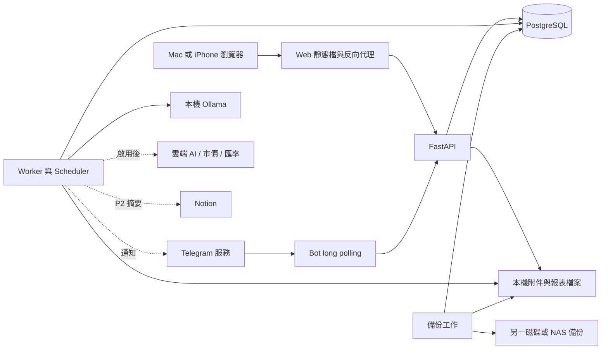

# 個人財務管理系統 — 系統架構

| 項目 | 內容 |
|---|---|
| 文件版本 | v0.2 |
| 建立 / 更新日期 | 2026-09-23 |
| 需求基準 | [01-requirements.md](01-requirements.md) v0.4 |
| 狀態 | 架構基線；Phase 0 已通過原生環境、遠端 Linux CI 及 Mac arm64 容器部署；登入自動啟動與睡眠恢復已驗；Phase 1 首批手動記帳見 docs/verification/phase-1.md |
| 配套文件 | [03-data-model.md](03-data-model.md)、[04-dev-plan.md](04-dev-plan.md) |

## 1. 架構決策與範圍

1. 採 **模組化單體後端**：Web、Telegram、排程共用 Python 業務服務與 PostgreSQL，不為每個功能建立獨立微服務。
2. **Web 為主要操作與圖表介面**；CSV、Numbers 相容 XLSX、PDF 是單向快照，Notion 是 P2 的可選摘要出口。遵守需求 §1.6、§2.5.1，不建立雙向外部帳本。
3. 財務寫入集中於帳本服務，使用精確十進位、平衡分錄、資料庫交易及冪等鍵。使用者介面維持收入 / 支出 / 轉帳，不要求使用者操作會計分錄。
4. 報表由 `analytics` 唯一計算。Web 圖表、檔案及 Notion 使用相同的 `ReportSnapshot`，不在不同通道重寫公式。
5. 本機保存正式帳本與附件；Telegram、雲端 AI、市價 / 匯率與 Notion 分別有明確資料流、設定與錯誤狀態。
6. 長時間工作使用資料庫保存的工作佇列。先不引入 Redis / Celery；工作可在重新啟動後續做。
7. 先單使用者，資料列仍有 `owner_id`。不提供公開註冊、家庭共享或角色管理；此欄位預留資料隔離能力，不代表多使用者功能已交付。

需求 01 決定產品範圍；本文件決定服務與介面；03 決定資料約束；04 決定工作順序。技術細化可由開發者依本基線執行。新增功能、改變已確認資料流或降低驗收目標時，需先記錄原因並同步相關文件，不能默默視為完成。

目前四份文件均放在儲存庫根目錄，與現有 `01-requirements.md` 保持一致。需求 §7 的 `docs/` 是初版目錄建議；未來若搬移，四份一起搬並更新連結，避免留下兩份有效需求。

## 2. 技術選型

以下為專案基線，**不表示已安裝或是最新版本**。Phase 0 需在 Apple Silicon 完成相容性驗證，將確切版本鎖在 lockfile 及映像標籤 / digest；不使用浮動 `latest` 作為部署依據。

| 層級 | 選擇 | 責任與理由 |
|---|---|---|
| 後端 | Python 3.12、FastAPI、Pydantic 2 | 型別驗證、REST API、OpenAPI；延續需求建議 |
| DB 存取 | SQLAlchemy 2、psycopg 3、Alembic | 明確交易邊界與版本化 migration；不讓 Bot 直接寫表 |
| 資料庫 | PostgreSQL 16、pgvector；搜尋另用 pg_trgm | 同時處理帳本、報表、背景工作及商品檢索；擴充於使用階段啟用 |
| 前端 | React 18、TypeScript、Vite、Tailwind CSS、shadcn/ui | 延續需求基線，鎖定相容組合；若需改主版本，記錄相容性理由 |
| 圖表 | **Apache ECharts** | 一套共用設定支援基本圖表及後續 Sankey / 熱力圖；前端只呈現後端數值 |
| CSV / XLSX | Python csv / XlsxWriter | CSV 保持可攜性；XLSX 寫入已計算結果與基本圖表，不依賴 Excel 巨集 |
| PDF | Jinja2 可信任模板 + Playwright Python / Chromium 列印 | 使用本機字型、共用 ECharts 報表繪圖 bundle，從快照產生固定版面；Phase 1.5 驗證 arm64 |
| Bot | python-telegram-bot，依需求 v21 為相容性起點 | Long polling，避免為收訊息開公開入口；確切版本與 API 需求在 Phase 2 鎖定 |
| 排程 | APScheduler 3.x + 自有持久化 Job 表 | APScheduler 只觸發掃描，補跑與去重由業務表負責，不依賴記憶體排程狀態 |
| AI | Provider 介面；正式採 macOS 原生 Ollama + Qwen3-VL 8B Instruct | M4 Pro / 24 GB；關閉雲端，測試有 fake provider；模型 ID 可設定、需做收據品質測試 |
| 認證 | Argon2 密碼雜湊、短效 JWT + 可撤銷 refresh session、可選 TOTP | 遵循需求；token 儲存與 CSRF 規則見 §8 |
| 部署 | Docker Compose；Ollama 原生 macOS | API / DB / worker 可重建；本地模型使用 macOS 的硬體加速能力 |
| 驗證 | pytest、Hypothesis、Vitest、Playwright；GitHub Actions | 帳本不變量、API / DB 整合、瀏覽器流程；CI 僅使用虛構資料 |

圖表、XLSX、PDF 僅共用「資料與規則」，不要求 XLSX 外觀與 Web 像素一致。XLSX 使用其原生基本圖表；PDF 使用與 Web 共用的呈現程式及列印樣式。

## 3. 執行拓樸

此圖描述目標拓樸，不代表所有容器須在 Phase 0 建立。

| 程序 | 啟用時間 | 網路 / 儲存 |
|---|---|---|
| `web` | Phase 0 | 服務前端靜態檔並將 `/api/` 代理到 API；預設只發佈到 Mac loopback |
| `api` | Phase 0 | 僅 Compose 內網；可讀寫 DB / 附件；不直接發送第三方請求作為寫帳的一部分 |
| `db` | Phase 0 | 不發佈公開連接埠；命名 volume 或固定本機 data 路徑 |
| `worker` | Phase 0 基礎佇列，按功能增加 handler | 與 API 共用後端程式；單一 scheduler leader；報表、OCR、報價等工作有分開的並行上限 |
| `bot` | Phase 2，可選 Compose profile | 只呼叫 API 及 Telegram；無 DB 密碼；沒有 Bot token 時核心系統仍能啟動 |
| Ollama | 使用本地 AI 時 | macOS 原生程序；容器透過受限的主機連線使用，不暴露到公網 |
| 備份程序 | Phase 0 | 以專用權限 dump DB 並複製不可變附件；不對外提供服務 |

開發時 Vite 可獨立執行並代理 API；正式本機部署使用已建置靜態檔。只有選定且驗證遠端存取方案後，才開放私人網路入口。資料庫與 Ollama 不隨 Web 一起對外開放。

## 4. 模組邊界

| 模組 | 擁有的邏輯 | 主要需求 |
|---|---|---|
| `core` | 使用者、設定、認證、Job、冪等、稽核、備份 / 全量匯出 | E-07、E-08、非功能需求 |
| `accounts` / `ledger` | 帳戶、負債、分錄、餘額、轉帳、匯率、估值與淨資產 | A-01～A-07、T-02 |
| `transactions` | 收支、分類、標籤、退款、拆帳、週期、規則與匯入 | T-01～T-13 |
| `receipts` | 上傳、解析草稿、品項、待確認與文件庫 | T-05、B-01、B-04、B-06、B-09、E-06 |
| `telegram_bot` | 指令與按鈕呈現、白名單、收訊息；計算交由 API | B-01～B-11 |
| `analytics` | 統一彙總、篩選、快照、計算版本、財務問答的讀取工具 | R-01～R-12、E-04 |
| `report_exports` | 快照轉 CSV / XLSX / PDF，管理檔案生命週期 | R-09A、R-09B、R-09C |
| `budgets_goals` / `subscriptions` | 預算、目標、帳單、月結；共用週期規則 | G-01～G-10、S-01～S-05、E-13 |
| `investments` | 成交、批次成本、持倉、報價、績效與股息 | I-01～I-09 |
| `price_tracker` / `product_lookup` | 商品正規化、歷史價格、混合搜尋與回饋 | P-01～P-10 |
| `tax` / `compensation` / `projections` | 年度規則、薪資、提撥、預測；輸出明確支援範圍 | X-01～X-10、C-01～C-08、G-09 |
| `notifications` | 通知模板、靜音、去重、傳送結果 | N-01～N-08 |
| `ai_assistant` | 文字轉有限的唯讀工具呼叫與有來源的回答 | E-01 |
| `notion_sync` | 白名單摘要同步、重試、失效標記；不寫帳 | R-13 |

各模組採 router → service → repository。service 負責交易邊界；repository 不自行 commit。跨模組透過 service / DTO，不跨層直接修改別人的表。Worker 可呼叫同一組 service，不能複製 API 的入帳邏輯。

## 5. 關鍵流程

### 5.1 手動、退款與轉帳入帳

1. API 驗證身分、owner、金額、幣別、日期、相關帳戶及 `Idempotency-Key`。
2. 鎖定相關資料列，依固定 ID 順序鎖帳戶以降低死鎖；檢查修訂版本與月結狀態。
3. 在一個 DB transaction 中建立交易版本、平衡分錄、分類分攤、必要事件與稽核，再更新帳本修訂號。
4. 成功提交後回傳交易 ID。任何步驟失敗全部 rollback；衍生報表失敗不能造成半筆轉帳。
5. 改帳採原分錄沖回 + 新版本，保留稽核。詳見 03 §3，轉帳 / 期初 / 投資本金不能當一般收入支出。

### 5.2 Telegram 收據與文字

1. Long polling 收到 update，Bot 檢查私聊與白名單；API 再檢查服務 token 權限及 Telegram ID 對應。
2. API 以 `(bot_identity, update_id)` 唯一鍵保存最小必要事件及處理工作，提交後 Bot 才持久化 offset / 確認接收。不能先推進 offset 再非同步存資料。
3. Worker 下載照片、驗證檔案、保存原圖，建立辨識工作；下載失敗可從已保存事件重試。附件與辨識不阻塞 Bot 收訊。
4. OCR / Vision 只產生結構化草稿。數字、日期、明細合計、稅金與折扣由程式驗證，缺值保留未知，不臆測成零。
5. 草稿 `needs_review` 後回覆確認卡片；只有使用者確認且必填資料有效才呼叫正式入帳服務。確認、重試或重複 update 最多產生一筆正式交易。
6. 確認前保存的品項原文供 Phase 5 回填索引；關鍵字、照片意圖判別與 `/lookup` 依原計畫在 Phase 5 啟用。

Telegram 未接收 updates 最多保留 24 小時，主機長時間關機不能保證找回。喚醒後顯示離線狀態 / 最近接收時間，必要時提示重新傳送；補跑只能保證本機已保存的事件。[Telegram 官方](https://core.telegram.org/bots/api#getting-updates)

### 5.3 共用報表與匯出

1. 使用者指定報表種類、期間、帳戶 / 分類、幣別、時區及是否採月結快照。
2. `analytics` 在短暫的 **REPEATABLE READ** 交易內讀取一致資料，產生 `ReportSnapshot`，保存明細、合計、引用匯率 / 報價、版本與資料缺漏標記。多次查詢不能各自取不同快照。[PostgreSQL 隔離說明](https://www.postgresql.org/docs/16/transaction-iso.html)
3. Web 顯示該 `snapshot_id`；使用者從這份報表匯出時，直接帶同一 ID。若選「更新資料」，建立新快照，不覆寫舊快照。
4. CSV / XLSX / PDF job 僅讀已存快照，不再查 live 交易重新加總；PDF 渲染期間不保持 DB 長交易。
5. 匯出檔放本機受控目錄；下載端點每次驗證 owner。CSV ZIP 包含明細、彙總與 metadata；XLSX 有需求指定的四張表；PDF 帶版本、幣別與時間。
6. 不同通道只比對對應指標。CSV 沒有圖表、XLSX 使用基本圖表、PDF 有列印版面，均不能因工具公式差異改變正式數值。

PDF worker 使用本地可信任 HTML、字型及繪圖 bundle；以結構化參數傳入快照，將備註等文字跳脫。瀏覽器禁止外部網路與任意 URL / 檔案讀取，等待字型與圖表完成再列印。匯出金額超出試算表精確表示範圍時以文字保留原值並註記，不能悄悄截斷。

### 5.4 商品查找與 AI 邊界

- 圖片先轉描述；搜尋結合商品別名、原始收據文字、中文子字串 / pg_trgm、英文全文與向量。不能只靠英文斷詞處理中文收據。
- 搜尋索引保留 `model_id + dimension + content_hash`；換 embedding 模型需重新建索引，不能混用不同向量空間。
- 先召回候選，再依商品、規格與品類分組，回傳來源交易 / 收據。統計以標準購買紀錄去重，不將同一筆在三種索引中的命中算三次。
- 缺品項價格的交易備註只顯示為線索；不能把整張收據金額當成單一商品價格。不同容量先換單位，不可比較者分組或標示無法比較。
- AI 財務問答只呼叫有驗證的唯讀工具，如 `get_spending_summary`、`search_transactions`；不執行模型產生的任意 SQL、指令或寫帳要求。所有金額由後端算出。
- 收據文字、商品包裝、匯入備註均是資料，不是可改變系統指令或開啟外部連線的權限。

### 5.5 Notion（Phase 8）

使用後端快照生成白名單 payload：月度收入 / 支出 / 儲蓄率、選定目標進度、期間與同步資訊。Notion 不讀 DB 憑證、不保存交易明細 / 收據。目標頁與資料範圍由使用者啟用時選擇。

以穩定 `external_key` 和本地映射更新系統管理區域，保留使用者筆記。外部建立請求 timeout 時先以該 key 查詢是否已成功，再重送；未釐清結果時標示 `reconcile_required`，不能盲目再建頁。來源失效時標記或封存系統摘要，不覆寫心得。關閉整合不刪既有 Notion 頁面，畫面清楚說明停止同步。

## 6. API 與前端契約

- 前綴 `/api/v1`；OpenAPI 是型別契約來源，產生前端型別並以 CI 檢查漂移。
- 金額 / 匯率 / 數量以十進位字串傳輸；UTC timestamp 使用帶時區 ISO 8601，帳務日期使用 `YYYY-MM-DD`。圖表可轉為 JS number 繪圖，顯示及合計使用後端字串結果。
- 財務寫入與排入工作要求冪等鍵；同鍵同內容回傳原結果，同鍵不同內容回 `409 idempotency_conflict`。編輯帶 `expected_revision`，過期回 `409 revision_conflict`。Phase 0 設定採 PUT + revision；登入 / refresh / TOTP 使用各自的 session / 一次性驗證規則，不重放認證結果。
- 清單使用 cursor 分頁，預設 50、上限 200；穩定排序含 ID，禁止無限制全部載入。
- 錯誤格式 `{code, message, field_errors, request_id}`；區分 `401/403`、`409`、`422`、`429`、`503`。不要回傳 token、SQL 或內部路徑。

| 端點族 | 核心操作 | 主要回傳 |
|---|---|---|
| `/auth/*`, `/settings` | 登入、refresh、登出、TOTP、首次設定 | session 與可用功能狀態 |
| `/accounts`, `/categories`, `/tags` | CRUD / archive、對帳 | 原幣餘額、revision、owner 範圍 |
| `/transactions` | 建立、查詢、修訂、作廢、退款 / 轉帳 | 交易 ID、版本、入帳狀態 |
| `/attachments`, `/receipts`, `/drafts` | 上傳、解析、查看及確認草稿 | job / draft ID，確認後 transaction ID |
| `/reports/snapshots` | 建立及讀取指定報表快照 | snapshot ID、ReportDocument |
| `/exports`, `/exports/{id}/download` | 由 snapshot 建立 / 下載檔案 | `202` job ID；完成後受權限保護的下載 |
| `/jobs/{id}` | 查工作狀態 / 可重試錯誤 | state、progress、error_code；前端輪詢 |
| `/budgets`, `/goals`, `/subscriptions` | 預算 / 目標 / 訂閱 | 計算結果與來源快照 |
| `/investments/*`, `/products/*`, `/lookup` | 成交 / 價格 / 商品查詢 | 明細、品質 / 過期標記 |
| `/tax/*`, `/compensation/*`, `/projections/*` | 試算、規則、薪資與情境 | result、ruleset、warnings、supported_scope |
| `/integrations/telegram/events` | 接收 Bot 已驗證事件 | durable accepted / duplicate |
| `/integrations/notion/*` | P2 設定與同步狀態 | last_success、待處理 / 失效項目 |

端點名稱是介面基線，Phase 0 先實作認證與健康檢查，其餘按階段加入。未實作模組顯示「尚未啟用」，不偽裝成功或填入零資料。

## 7. 背景工作、睡眠與外部失敗

`Job` 狀態為 `queued → running → succeeded`，失敗走 `retry_wait → queued` 或 `failed`；取消為 `cancelled`。Worker 用 `FOR UPDATE SKIP LOCKED` 領取，提交 lease 後才做慢工作；心跳續約，lease 過期可重新領取。每個 handler 必須可重入。

- API 在同一 DB transaction 寫業務資料與 job / outbox，避免「已入帳但未排通知」。外部傳送不放在入帳 transaction 裡。
- 以 `(owner, job_kind, logical_key)` 去重；處理語意是至少一次，帳本以唯一鍵保證有效寫入一次。外部通知在回應不明時可能重複，需記錄 `delivery_unknown`，不能宣稱端到端 exactly once。
- 重試採指數退避、上限及 jitter；尊重外部 `Retry-After`。金鑰無效與驗證錯誤不無限重試。
- 初期 PDF 同時 1 件、本地 Vision 同時 1 件；IO 工作使用有限並行與 timeout，實測後調整。
- APScheduler 喚醒後掃描持久化到期表。每月 31 日遇短月採月底；排程保存 IANA 時區，DST 不存在時間移到下一有效時間、重複時間只處理一次。
- 週期交易按每個尚未處理的 occurrence 補齊；超過設定批次上限保留待辦並顯示補跑進度。每日摘要僅補最近一份並標示涵蓋日期，不能一次轟炸多天通知。
- 週期規則區分自動入帳與僅建立預期帳單；自動帳目仍需核實實際扣款，後續匯入應匹配既有紀錄。S-04 不以自動產生交易作為銀行已扣款的證據，詳見 03 §6。
- 睡眠期間缺失的淨資產快照不以目前餘額偽造；有歷史分錄與報價才重建，標記 `reconstructed` 及缺失來源。
- 外部關閉時，手動記帳可用；缺匯率 / 報價時保留原幣、顯示未換算或過期資料，不以 1 或 0 代替。

## 8. 認證、附件與機密

- 單使用者初始化用本機 CLI 互動設定密碼，沒有預設密碼與公開註冊。Argon2 雜湊，登入限速。
- Web 同源；access JWT 短效，放 HttpOnly cookie；refresh 隨機 token 只存雜湊、輪替且能撤銷。狀態變更驗證 CSRF token 與 Origin，cookie 使用適當 SameSite。HTTPS 啟用 Secure；僅 loopback 開發可用明確的非 Secure 開發設定。
- Bot 使用獨立可撤銷服務 token，只能處理指定 owner 的收訊與草稿流程。每個附件、報表、job、Notion 設定都檢查 owner，不能僅憑 UUID 存取。
- TOTP secret 加密保存，金鑰在本機機密設定；備援碼雜湊。備份 / 還原演練包含金鑰保管與重新登入。
- API key / Bot token / DB password 不寫進 Git、日誌、快照與全量資料匯出；`.env.example` 只放名稱及無敏感範例。測試使用替身與虛構資料。
- 附件使用隨機儲存 key、檔案大小 / MIME / 實際解碼驗證、像素上限、路徑穿越防護。原檔不做可執行 HTML 服務；預覽使用安全轉檔，下載為 attachment。
- 相片支援 JPEG / PNG，iPhone HEIC 需轉檔驗證；PDF 收據在支援前顯示限制，不靜默失敗。暫存商品查詢照片完成 / 失敗後皆清理，保留原則依 Q16。
- 日誌只記 request ID、job ID、狀態與耗時，不記完整收據、帳號或模型提示。前端不將財務回應放公共 service-worker cache。

## 9. 備份、還原與資料生命週期

E-07 使用每日 `pg_dump` + 附件 manifest。備份期間取得全系統寫入維護鎖，暫停 API / worker 業務寫入及附件刪除；使用者讀取可持續。Job 心跳只更新 lease 中繼資料，可繼續以防長備份造成誤判逾時；不得藉此寫入業務資料。完成一致 DB dump 與所需不可變附件清單後，複製 / 校驗附件，再發佈完整備份標記。失敗不得把半成品標為成功。[PostgreSQL 備份說明](https://www.postgresql.org/docs/16/backup-dump.html)

- 保存 schema version、app commit、DB 版本、manifest、SHA-256 與完成時間。目標為另一磁碟或 NAS，保留 30 天；同磁碟暫存不能宣稱具備磁碟故障保護。
- 備份包含原始收據、必要設定、帳本與月結快照；機密另行加密保管。Notion、一般報表檔案及 CSV 不能取代備份。
- 還原至隔離空白環境，停用 Bot 輪詢與外部傳送，驗證筆數、分錄平衡、附件 hash、代表性報表及登入，確定後才切換。不得以真實資料庫做測試清空。
- 上版前先備份，migration 由一次性程序執行；API/worker 確認 schema 相容後啟動。破壞性 migration 先採新增 / 回填 / 切換，保留回復步驟。
- 報表檔 / 非月結快照可依期限清理（基線 30 天）；月結、正式分錄、稽核及原始憑證不隨暫存清理。任何被月結引用的快照均禁止自動清除。
- E-08 匯出含 schema manifest、穩定 ID、完整可攜的帳務資料、附件索引；機密及可重建向量排除並在 manifest 說明。

## 10. 品質、效能與觀測

資料正確性優先驗證：分錄平衡、信用卡還款不重複計支出、退款上限、重試不重複寫入、跨幣別與分類合計一致。帳本及 job 整合測試使用真正 PostgreSQL，不能以 SQLite 通過代替。

| 指標 | 需求目標 / 執行方式 |
|---|---|
| 報表 | 10 萬筆交易查詢 < 2 秒；以固定資料集、查詢種類、索引、容器資源與 p95 記錄，冷 / 暖快取分開；完整 PDF 渲染另記耗時 |
| 收據 | 原需求 < 15 秒保留為驗收目標；記錄下載、排隊、模型冷啟動與解析各段，不以收到訊息回覆取代完成時間 |
| 商品查找 | 關鍵字 < 3 秒；照片雲端 < 10 秒 / 本地 < 30 秒；依需求測試，供應商與硬體另記 |
| 輸入體驗 | 「3 秒完成記帳」與辨識時間的界線尚需 D-04 釐清；先提供接收 / 處理狀態，不宣稱整體達標 |
| 備份 | 每日排程、保存 30 天；睡眠後補跑並顯示最近成功時間；實際還原演練才算驗收 |
| 可觀測性 | `/health/live`、`/health/ready`、job 佇列長度、最近備份 / Bot 收訊 / 報價時間；顯示功能未設定與外部故障 |

健康檢查不可依賴可選 AI / Notion 成功才讓核心 API ready。資源使用、磁碟不足、備份過期與工作失敗要在本機 Web 看得到，即使 Telegram 故障也不失去所有告警入口。

## 11. 開發、Git 與部署邊界

- 檔案採需求規劃的 `backend/`、`frontend/`、`bot/`、`scripts/`、`data/`；增加 `ledger/`、`report_exports/`，`notion_sync/` 到 P2 才建。
- `AGENTS.md` 已在 Phase 0 建立，記錄啟動、測試及 migration 指令；需要先滿足 README 的環境條件。
- 重要財務與 schema 改動先有驗收案例；前端用 API 契約與虛構資料開發。工作完成需實際操作主流程，不只看編譯成功。
- Git 保存程式、文件、migration、lockfile 及去識別化 fixtures；排除 `.env`、DB、收據、備份、匯出、模型檔、日誌與瀏覽器登入狀態。
- 開發用 skills / Agent 不是產品執行依賴。App 啟動及排程不依賴 Codex 開著，也不依賴開發用 Notion 插件。按需分工方式見 04。

## 12. 決策待辦與依賴處理

| 決策 | 來源 | 文件中的處理 | 最晚需要確認 |
|---|---|---|---|
| D-01 幣別、時區、分類 | Q1、Q10；時區另需首次設定 | 測試可用 USD / America/Los_Angeles 虛構帳本；正式帳本由首次設定選取，不能視為個人答案 | 第一筆正式交易前 |
| D-02 稅務身分 / 地區 / 自雇 | Q2、Q3、Q4 | 不猜州別、報稅身分、居住者資格或 1099；未設定的稅務計算停用 | Phase 6 |
| D-03 投資支援範圍 | Q5 | 保留所有需求資產類型，不把未支援標的視為股票套公式；按類型逐項驗收 | Phase 4 |
| D-04 AI、RAM、語言與速度 | Q6、Q12、Q17；§1.2 與 §3 效能口徑 | 已選原生 Ollama + Qwen3-VL 8B Instruct，實機 M4 Pro / 24 GB；多語品質、冷暖啟動及 p95 待驗，不承諾必達速度 | Phase 2；若目標需變更先改需求 |
| D-05 常駐 / 遠端 / 推播 | Q7、Q8、Q9 | 本機 Web 預設；排程可設定但未設定不發送；睡眠恢復按 §7 | Phase 2 實際啟用前 |
| D-06 匯入及家庭帳本 | Q11、Q13 | 沒有真實資料仍可開發；單使用者 + owner_id，不實作多人權限 | 匯入或新增使用者前 |
| D-07 商品查找範圍 / 照片 | Q15、Q16 | 沿用需求預設：搜尋手動備註，查詢照片用後清理；設定可調整 | Phase 5 |
| D-08 薪酬、退休及預測 | Q18、Q19、Q20 | 參數可設定，示例不冒充個人薪資 / 稅率或預測承諾 | Phase 6.5 |
| D-09 功能依賴 | B-04→T-07、I-03→成本法、P-09→B-06、RV-01→T-12 | 04 安排最小前置功能提前；保留完整功能原需求優先級 | 對應任務開始前 |

## 13. 技術依據

查閱日期 2026-09-23；此處引用能力與限制，確切依賴版本在建置時鎖定。

- [FastAPI 容器部署](https://fastapi.tiangolo.com/deployment/docker/)、[SQLAlchemy 交易邊界](https://docs.sqlalchemy.org/en/20/orm/session_transaction.html)。
- [PostgreSQL 精確數值](https://www.postgresql.org/docs/current/datatype-numeric.html)、[pgvector 模型與索引限制](https://github.com/pgvector/pgvector)。
- [APScheduler 3 使用指南](https://apscheduler.readthedocs.io/en/3.x/userguide.html)：重啟、misfire 與 coalescing 需明確配置，業務補跑仍由本系統定義。
- [ECharts 渲染方式](https://echarts.apache.org/handbook/en/how-to/cross-platform/server/)、[XlsxWriter 圖表](https://xlsxwriter.readthedocs.io/working_with_charts.html)、[Playwright PDF](https://playwright.dev/python/docs/api/class-page#page-pdf)。
- [Ollama 官方 FAQ](https://docs.ollama.com/faq#how-do-i-use-ollama-with-gpu-acceleration-in-docker)：macOS Docker GPU 限制是採原生 Ollama 的原因。
- Numbers / Notion 相容性依據與 RV-01～RV-08 見需求 §2.5.1。

## 14. Phase 0 實作記錄

- 實際依賴鎖定於 `backend/uv.lock`、`frontend/pnpm-lock.yaml`；原生 Python 3.12.14、Node 24.19.0、PostgreSQL 16.15 已用於驗證。
- 容器後端以 PostgreSQL 16.15 映像搭配 uv 管理的 Python 3.12.14，確保 pg_dump / pg_restore 與 DB 同版；Node、PostgreSQL、Nginx 映像已固定 digest，平台清單含 linux/arm64。映像平台資料不等於已通過 Mac 容器執行驗收。
- Phase 0 的 DB / API / worker 只連 internal 私有網路；Nginx 同時連接 edge bridge 與私有網路，僅將 Web 發佈至 `127.0.0.1:8080`，並以 HTTP 健康檢查確認代理可用。未來後端需要外部 API 時才增加受控對外網路。開發 Vite 5173 / API 8000 僅綁 loopback。
- 認證將 refresh token 歷史與撤銷狀態拆成 `auth_sessions` / `session_families`，支援輪替後舊 token 重放時撤銷整個 family。Schema 的精確映射見 03 §14。
- 各項通過與未驗證的證據見 [Phase 0 驗證紀錄](docs/verification/phase-0.md)。本紀錄不代表 Phase 1 的帳務、圖表或附件功能已完成。

## 13. Phase 1 首批實作界線

`app/ledger` 先集中帳戶、分錄服務、查詢、報表與 CSV。所有業務寫入先取得維護共享鎖，再鎖 owner 的 book_settings；報表使用相同 owner 鎖凍結資料，CSV 僅讀已保存快照。ECharts 6.0.0 使用模組化匯入及 SVG renderer，遵循[官方匯入方式](https://echarts.apache.org/handbook/en/basics/import/)。金額仍由後端 Decimal 計算；圖形座標才轉前端數值。

本版 merchant 為交易文字、tags 為受限字串清單，沒有宣稱正規化商家／標籤庫完成；後續保留原字串遷移至實體與連接表。人工估值匯率與歷史入帳匯率分開保存。淨資產曲線從有效帳本重建並標示狀態，每日封存、自動 provider、週期／全量匯出仍維持 04 的未完成清單。

### D1-04 附件實作（2026-09-24）

`receipts` 模組提供 `/transactions/{id}/attachments` 的 GET / POST、`/transactions/{id}/attachments/{attachment_id}` 的 DELETE，以及 `/attachments/{id}/preview|original`。每次上傳為受限 raw binary body + filename query + Idempotency-Key，前端按序送出多圖並獨立保留失敗項目。cookie 寫入沿用 CSRF / exact Origin，全部讀寫核對 owner，沒有公開檔案 URL。Nginx 僅附件路徑放寬至 20 MiB；其他路徑保留 1 MiB。

Pillow 12.3.0 / pillow-heif 1.8.0 鎖定版本；完整解碼後才接受 JPEG / PNG / HEIC，限制 5,000 萬像素與單影格。PNG 透明背景轉白、依 EXIF 旋轉，再由全新 image 產生最長邊 1600px JPEG 預覽，不帶原 EXIF / GPS / XMP。原始位元組保持不變；只能以 attachment 下載，名稱使用已驗證圖片類型的副檔名。預覽經登入 API 取 blob，由受限 `img-src blob:` 顯示。

所有檔案寫入／清理持有共用備份維護鎖與獨立附件 advisory lock；附件業務寫入再鎖 owner book row。先將兩個檔案以 0600 寫入 UUID staging 目錄、fsync，再原子 rename 至 objects，最後同一 DB transaction 提交 metadata、收據頁序及交易關聯。中途中斷最多留下未引用檔，不出現 DB ready 指向尚未發布的檔案；回覆遺失以同 key 重試取得同一附件。Worker 每 5 分鐘掃描，只清理至少 24 小時的 UUID 孤兒／staging，或確定無引用的 deleting 檔案，拒絕符號連結。ready 檔案缺失或雜湊不符必須報錯。

備份在獨占維護鎖內驗證 DB 引用及原圖／預覽 SHA-256，僅複製 active objects，記錄四張附件／收據表的 metadata 指紋；隔離還原再核對。0001 / 0002 舊備份仍可隔離還原，但須升級 schema 後啟用新版服務。參考：[Pillow Image](https://pillow.readthedocs.io/en/stable/reference/Image.html)、[pillow-heif plugin](https://pillow-heif.readthedocs.io/en/latest/pillow-plugin.html)；本版本以本機與容器實測為準。

## 2026-09-24：Capture / Telegram 首批實作決策

依使用者要求先交付可啟用程式，provider 預設 disabled。Python 模組在 `backend/app/capture/`；Compose `capture-bridge` profile 以同一鎖定映像執行獨立程序，只有 API scoped token、所選 OCR key 及 Bot Token，沒有 DB 憑證或檔案掛載。核心 API / worker 保持 private network；bridge 以 API 取得受租約保護的工作／預覽，分開輪詢、下載、辨識、傳送，OCR 不阻塞收訊。

相容性決策：此批只需要 getMe / getUpdates / getFile / sendMessage / answerCallbackQuery，採 Python 標準函式庫的窄 HTTP adapter 與固定 Telegram API 網域，暫不導入原基線 python-telegram-bot v21；沒有未鎖定第三方依賴。HTTPS、拒絕 redirect、回應大小與逾時、redacted errors、429 retry_after 在共用 transport。若後續指令／事件種類大幅增加，再評估 SDK。

Bridge 分別向 API claim 三種工作；核心 worker 排除這三種。API 核對 owner、token scope/expiry/revocation、lease token 與草稿 revision 後才套用結果。heartbeat 為獨立 metadata 更新，可在備份維護鎖期間續租。長輪詢 offset 只在事件與效果提交後推進；外部回覆為 at-least-once，財務確認用固定 draft id 冪等。Telegram 確認直接使用頂層 DB transaction，避免 ledger xmin 不可變保護與 nested savepoint 的子交易 ID 衝突；輸入失敗先完整 rollback，再另立交易保存 inbox 與錯誤回覆。

Web 與 Bot 共用草稿、保存圖片與 ledger service；AI 只輸出型別化事實，沒有寫帳或工具執行權。圖片以去除中繼資料的 JPEG 預覽送 provider，原圖不可變。未完成照片下載時禁止確認；下載中的人工修改保留，圖片仍保存且不自動覆蓋修改。未確定金額／幣別／日期為 null，不代填帳戶或分類。人工確認是唯一正式入帳入口。

初版一張圖片一份草稿，取消保留圖片及歷程；完整拆分類在 Web，品項正規化與人工逐欄修正後續擴充。可插拔 Ollama / OpenAI Responses（store=false）已實作，但未選型前不呼叫；目前不提供 Gemini / PaddleOCR，也不宣稱任何實測辨識速度。每日通知未啟用。

### 本機模型選定（2026-09-24）

使用者採本機方案，選 `qwen3-vl:8b-instruct`（Q4_K_M，模型約 6.1 GB）。Ollama 安裝於 `/Applications/Ollama.app`，以本機 LaunchAgent `com.finance-tracker.ollama` 啟動原生 `ollama serve`，使用 Apple GPU；不在 Linux 容器執行模型。模型下載存 `~/.ollama`，不納入 Git 或帳本備份，可依版本與 digest 重新下載。

服務僅綁 `127.0.0.1:11434`，`OLLAMA_NO_CLOUD=1`，沒有雲端失敗備援。Docker Desktop 的 `host.docker.internal` 連線路徑在此 Mac 實測可用；換機先探測，不自動開放 LAN。一次載入一個模型、單一並行請求、context 8192、閒置 2 分鐘卸載模型。LaunchAgent 為登入後服務，睡眠時不能辨識；實際睡眠喚醒仍須另驗。

`scripts/enable-local-ai.py` 先檢查本機模型具有 vision 能力且非遠端模型，再從 capture-bridge 驗證連線；失敗不寫設定。通過後以 `--apply` 保留原有 Telegram 配對及機密、原子更新 provider 設定並套用 Compose。只重新辨識使用者選取的草稿，不批次覆蓋其他人工草稿，也不確認交易。安裝與實測結果見 `docs/verification/local-ai.md`。

### 收據品質修正（提示版本 2）

新版提示分別讀取小計、含稅 Total、小費及最終付款；現金找零不視為支出。Ollama 除 `format` 外，提示也附 JSON schema，依 [官方 structured outputs 建議](https://docs.ollama.com/capabilities/structured-outputs) 提供欄位定義，temperature 維持 0。這能改善已知小計誤讀，但不保證所有圖片正確。

建立 `capture_parse` 工作時固定 `payload.prompt_version`；bridge 使用該版本，完成或失敗時寫入 `receipt_parse_attempts.prompt_version`。既有缺少版本的工作沿用版本 1，舊提示與原始辨識歷程保留。資料 schema 與解析 schema 均未變更。

模型可能推測幣別，甚至捏造「原圖印有 US$」的證據，因此不以模型自述作驗證。版本 2 只有在使用者原始文字／Telegram 圖說明確寫出唯一 USD、US$、美元／美金或 TWD、NT$、新台幣／新臺幣，且與模型結果一致時才帶入幣別；純圖片、裸 $、地址、相互衝突的代碼留待人工選擇。模型建議仍保留於原始結果及辨識歷程，網頁標明僅供參考。帳戶／分類與確認入帳仍由使用者決定。

`scripts/evaluate-local-ai.py` 用版本控制的中英合成圖片獨立量測本機模型，沒有 DB 或 Telegram 寫入；模型猜錯仍回報失敗，不以應用層防護偽裝成 OCR 正確。品質與效能紀錄見 [receipt-quality.md](docs/verification/receipt-quality.md)。
