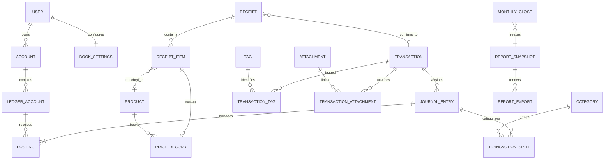

# 個人財務管理系統 — 資料模型與帳務規則

| 項目 | 內容 |
|---|---|
| 文件版本 | v0.2 |
| 建立 / 更新日期 | 2026-09-23 |
| 需求基準 | [01-requirements.md](01-requirements.md) v0.4 |
| 架構基準 | [02-architecture.md](02-architecture.md) v0.2 |
| 狀態 | Phase 0 核心 migration 已實作；本文其餘表仍為後續設計，精確實作映射見 §14 |
| 開發對照 | [04-dev-plan.md](04-dev-plan.md) |

## 1. 共通欄位、精度與命名

資料表使用 snake_case 複數名；本文 PascalCase 是領域實體名。`?` 表示可為 NULL，其餘列出的業務欄位原則上必填；衍生值如餘額不直接由使用者修改。

| 項目 | 規則 |
|---|---|
| 主鍵 | UUID，由應用程式產生；不以時間或可猜測流水號作為存取授權 |
| `Owned` 共通欄位 | `id UUID`、`owner_id UUID → users`、`created_at timestamptz`、`updated_at timestamptz`；不可變記錄不更新 updated_at |
| 可編輯實體 | 加 `revision integer >= 1`；修改時比較 expected_revision；archive 使用 `archived_at?` |
| owner 關聯 | Owned 表有 `UNIQUE(owner_id,id)`；相關 FK 使用 `(owner_id, target_id)`，禁止跨 owner 掛接帳戶、交易、附件等 |
| 金額、數量、匯率 | PostgreSQL `NUMERIC(38,18)`、Python Decimal、JSON 字串；有限值且禁止 NaN / Infinity；匯率 > 0 |
| 幣別精度 | `Currency.amount_scale` 定義允許小數位；超精度輸入拒絕或由使用者明確確認捨入，不能 DB 默默截斷；基準幣別限法幣 |
| 捨入 | 一般帳務採 Decimal ROUND_HALF_UP，於入帳 / 換算邊界依幣別精度量化；尾差用確定性分配或顯式 rounding 行，不以容差略過；稅務另用 ruleset 指定方式 |
| 日期 | `occurred_on DATE` 是帳務日期；`occurred_at timestamptz?` 是已知的實際時間，未知時不捏造；排程另存 IANA 時區 |
| JSONB | 用於外部原始結果、規則與不可變快照；有版本化 schema。帳戶 / 交易 / 金額 / 關聯仍用可約束欄位，不以任意 JSON 取代 |
| enum | 使用明確 CHECK / lookup 值並由 migration 擴充；應用程式驗證同一集合 |
| 個人設定 | 主幣別、報稅身分、州別、推播時間等尚未回答，保留首次設定或模組啟用時填寫，不硬編碼成使用者事實 |

主幣別在第一筆正式分錄後固定為帳本的 `book_currency`。使用者仍可切換**報表顯示幣別**；改帳本基準幣別屬於需規劃遷移的獨立操作，不覆寫歷史分錄。

## 2. 核心關係



`Account` 是使用者看到的銀行、信用卡等帳戶；`LedgerAccount` 是內部會計分類。系統收入 / 支出 / 期初權益帳可不綁使用者帳戶。後期關係詳見各節，不要求 Phase 0 一次建齊全部表。

## 3. 帳本核心與不可變規則

### 3.1 實體

| 表 / 階段 | 欄位 | 關聯與限制 |
|---|---|---|
| `users` / 0 | id、login_name、password_hash、disabled_at?、created_at | login_name 唯一；不保存明文密碼 |
| `book_settings` / 0 | owner_id PK、book_currency?、timezone?、locale、setup_completed_at?、ledger_revision bigint、valuation_revision bigint、settings_revision bigint | 初始可未完成設定；第一筆正式分錄前須有幣別 / 時區；資料變更在同交易內遞增對應 revision |
| `currencies` / 0 建表、1 擴充 | code TEXT PK、kind、amount_scale 0..18、display_scale、name | 先供 book_settings 外鍵與首次設定；crypto 使用命名空間避免代號混淆；法幣與資產單位不混用 |
| `accounts` / 1 | Owned、name、kind、currency、include_in_net_worth、valuation_mode、institution?、archived_at?、revision | kind 含 cash/bank/credit_card/payment/brokerage/retirement/crypto/real_estate/vehicle/loan；有歷史資料只 archive；非零餘額封存須提示仍納入估值 |
| `ledger_accounts` / 1 | Owned、account_id?、code、class、currency、role、security_id?（Phase 4） | class=asset/liability/income/expense/equity；role 區分 cash、holding_cost、opening、fx_bridge、rounding 等；同 owner/code 唯一；帳戶幣別須相容 |
| `transactions` / 1 | Owned、kind、source、status、current_entry_id?、merchant_id?、note?、refund_of_id?、revision、voided_at? | kind=expense/income/transfer/refund/opening/adjustment/investment/payroll；source=manual/telegram/import/recurring；status=draft/posted/voided；current_entry 必須屬於本交易 |
| `journal_entries` / 1 | Owned、transaction_id、revision_no、entry_role、occurred_on、occurred_at?、book_currency、reverses_entry_id?、supersedes_entry_id?、posted_at、reason? | entry_role=original/reversal/replacement；`UNIQUE(transaction_id,revision_no,entry_role)`；每個被沖回分錄只能有一個 reversal；正式記錄不可更新或刪除 |
| `postings` / 1 | Owned、entry_id、line_no、ledger_account_id、currency、amount_signed、book_amount_signed、fx_quote_id?、fx_rate、component | `UNIQUE(entry_id,line_no)`；currency 等於 ledger account currency；至少兩行且金額非零；component=principal/income/expense/tax/fee/valuation/fx/rounding/opening |
| `transaction_splits` / 1 基礎、2 拆帳 UI | Owned、entry_id、posting_id、line_no、category_id、amount_signed、book_amount_signed、memo? | 對收入 / 支出 posting 分類；每行屬同 entry / currency；分攤加總等於該 posting，不能與 posting 各自被報表加總一次 |
| `refund_allocations` / 1 | Owned、refund_entry_id、original_transaction_id、original_split_id、original_currency、original_amount、received_currency、received_amount | original_amount / received_amount > 0；以原幣金額檢查每個原分類分攤與交易的可退額；退款修訂產生新 entry 的分配，計算上限只採有效版本 |
| `categories` / 1 | Owned、parent_id?、name、kind、icon?、color?、archived_at? | kind=income/expense；最多兩層，parent 同 owner/kind，不可循環；archive 不刪歷史分類 |
| `tags`, `transaction_tags` / 1 | Tag: Owned、name、kind；連結: owner_id、transaction_id、tag_id | Tag 同 owner/name 唯一；連結複合 PK；稅務標籤保留結構化 kind |
| `merchants` / 1 | Owned、name、normalized_name、aliases JSONB、default_category_id?、default_tag_ids JSONB | 記帳商家記憶由 service 驗證標籤 owner；別名衝突需人工選擇，不隨意合併 |
| `loan_terms` / 1 | Owned、account_id、principal、annual_rate、payment_amount、payment_frequency、start_on、due_day?、maturity_on? | account 為 liability；僅條款，不把本金重複加入帳戶餘額；攤還明細於 A-07 加入 |
| `audit_logs` / 0 | Owned、actor_type、actor_id?、action、entity_type、entity_id、revision?、request_id、redacted_diff JSONB、recorded_at | append-only；不含機密與收據原文；正式改帳須有理由及可追溯版本 |

### 3.2 借貸與餘額

- **借方為正、貸方為負**。每個正式 JournalEntry 的 `SUM(book_amount_signed) = 0`，以基準幣別精度精確成立；至少兩行。原幣不同時不直接把原幣 amount 相加。
- 同幣別普通分錄原幣也需平衡；跨幣別分錄依 3.4 使用明確換算與 FX bridge 行平衡。
- 資產原幣餘額 = 對應資產 LedgerAccount 的正式 posting 加總；信用卡欠款 = 負債 LedgerAccount 加總的負值。負債餘額若成借方，呈現為溢繳 / 債權，不強制截成零。
- 帳戶頁可有餘額快取，但它必須可從 postings 重建，不能成為另一份可獨立修改的真實資料。
- `opening` 對應期初權益、`adjustment` 對應差異調整，不計一般收入支出；自有帳戶轉帳本金不計收支；手續費是獨立 expense component。
- 正式帳本只允許 service 的受控過帳程序寫入。migration 建立 deferred constraint trigger 檢查分錄平衡、至少兩行、split 加總及 owner/currency；限制後續新增 posting 至既有已提交 entry，禁止更新 / 刪除正式 entry、posting、split。不能只在前端驗證。

### 3.3 更正、作廢與退款

**更正不是退款。** 更正原始錯誤資料時，在一個 DB transaction 插入原 entry 的完全反向分錄，再插入 replacement，更新 `current_entry_id` 和 revision。沖回保留原帳務日期；replacement 使用更正後日期。作廢只沖回並將 current_entry 清空。更動日期涉及的兩個月份都要檢查月結鎖。

帳戶餘額從所有正式分錄（含沖回）累計；一般交易與收支報表使用每筆 posted transaction 的 current_entry，避免把版本與 reversal 當成多次消費。兩條計算路徑需以測試驗證一致。

退款是新的 `kind=refund` transaction，`refund_of_id` 指向原 expense transaction，保留退款發生日期，反向扣減原分類支出。可多次部分退款；鎖定原交易後檢查有效退款合計不超過原可退金額。原交易被修改或作廢時，需同時確保既有退款仍有效，否則拒絕並要求先處理關聯。

`refund_allocations` 保存退款實際對應的原分類分攤，不以使用者隨意輸入的分類取代來源。已被退款引用的原分攤若要更正，需在同一操作中重建關聯並重驗上限；未支援此流程前拒絕該更正。退款 entry 與其分配不可變，跨幣別的可退額及實收額分開驗證。

基線採退款實際月份沖銷支出，不自動改寫原月；已關帳月份不可改帳，需顯式 reopen 並於重結時新增快照版本，原快照保留。跨幣別退款保留原交易可退金額與退款實收兩種幣別 / 金額，匯差另外列示，不因匯率變動誤判超退。

### 3.4 匯率與跨幣別

`FxQuote` 欄位：id、base_currency、quote_currency、rate、effective_at、provider、fetched_at、manual_reason?、source_hash。rate 定義為「1 base 換得多少 quote」，唯一鍵含 pair / provider / effective_at / source_hash，修正資料新增版本。交易保存使用的 rate，不會因重新抓匯率改變歷史 book_amount。

跨幣別轉帳必填實際扣款 / 入款帳戶與各自金額，手續費另列。兩端換成 book_currency 後若不平衡，差額以 `fx_bridge` 系統帳及明確 component 記錄；這是帳本換算差異，**不能直接冒充稅務已實現匯兌損益**。一般生活收支排除此 bridge；稅務匯差需有獨立成本規則才可計入。

換算政策版本化：歷史收支使用帳務日期當日可用 quote（或最近先前 quote 並標示來源），淨資產使用估值時點 quote。缺資料可手動輸入並附來源；不能回退為 1。不同報表幣別仍從保存的原幣及指定政策換算，結果保存在快照。

### 3.5 基本驗算資料（虛構，book_currency=USD）

| 案例 | 分錄 | 預期 |
|---|---|---|
| F-01 期初存款 1,000 | 銀行 +1000、期初權益 -1000 | 銀行 1000，收入 0 |
| F-02 刷卡買食材 100 | 食材支出 +100、卡債 -100 | 支出 100，欠款 100 |
| F-03 繳卡費 100 | 卡債 +100、銀行 -100 | 銀行 900，欠款 0；新增支出 0，淨資產與還款前相同 |
| F-04 退回卡上 20 | 卡債 +20、食材支出 -20 | 淨支出 80，卡上溢繳 20；退款日計入沖銷 |
| F-05 轉到現金 200，費用 2 | 現金 +200、費用 +2、銀行 -202 | 本金不是支出，支出只有 2 |
| F-06 USD 100 換 TWD 3,200，率 32 | USD 銀行 -100（book -100）、TWD 銀行 +3200（book +100） | book 合計 0；原幣各保存，不加總成 3100 |
| F-07 分類分攤 100 為 60 / 40 | expense posting +100，split 60 / 40 | 分類合計及總支出都是 100 |
| F-08 重複確認同一草稿 | 同一 confirmation key 再提交 | 只有一筆 transaction 與一組有效分錄 |

3.5 前四例可連續執行；其他案例以各自獨立 fixture 驗算，避免將不同初始狀態混用。

## 4. 認證、冪等、工作與附件

| 表 / 階段 | 主要欄位 | 約束 / 生命週期 |
|---|---|---|
| `auth_sessions` / 0 | Owned、refresh_hash、expires_at、revoked_at?、last_used_at、rotation_family | refresh hash 唯一；輪替與重放偵測；登出撤銷；匯出排除 |
| `api_tokens` / 0 | Owned、token_hash、scopes JSONB、expires_at?、revoked_at? | Bot / 整合最小權限，不保存明文 |
| `totp_credentials` / 0 | owner_id PK、encrypted_secret、enabled_at?、recovery_hashes | 本機外部加密金鑰，啟用前驗證一次；匯出排除 |
| `idempotency_records` / 0 | Owned、operation、key、request_hash、resource_type、resource_id、response_code | `UNIQUE(owner_id,operation,key)`；同鍵異內容 409；正式寫帳使用過的識別不可隨短期 cache 過期而失效 |
| `jobs` / 0 | Owned、kind、logical_key、payload_version、payload JSONB、status、attempts、run_after、lease_until?、lease_token?、heartbeat_at?、error_code? | `UNIQUE(owner_id,kind,logical_key)`；依 status/run_after 索引；retry 只更新同 job；payload 不存金鑰 |
| `outbox_events` / 0 | Owned、event_type、entity_id、entity_revision、payload、published_at? | 與業務交易同時 commit；consumer 以 event ID 去重 |
| `attachments` / 1 | Owned、storage_key、sha256、mime、size_bytes、original_name?、purpose、status、retention_until? | status=staging/ready/failed/deleting；只 ready 可引用；隨機 key 唯一，hash 用於重複提示，不能只因同圖就禁止合法交易 |
| `transaction_attachments` / 1 | owner_id、transaction_id、attachment_id、role | 複合 PK；原圖以多附件支援長收據，無關聯的 staging 檔由受控 GC 清理 |
| `telegram_events` / 2 | Owned、bot_identity、update_id BIGINT、chat_id BIGINT、message_id BIGINT、telegram_user_id BIGINT、received_at、payload JSONB、job_id、status | `(bot_identity,update_id)` 唯一；資料提交後才推進接收 offset；不將 BIGINT 當 JS 安全整數假設 |
| `telegram_cursors` / 2 | bot_identity PK、next_offset BIGINT、last_received_at | Bot 重啟續收；offset 僅在事件 durable accepted 後更新 |

檔案與 DB 無法共用單一 transaction：先寫 staging 並校驗 hash，以原子 rename 完成檔案，再將 attachment 設 ready。崩潰遺留檔可清理；ready 記錄若檔案缺失顯示錯誤，不能假裝辨識成功。

## 5. 收據、草稿與文件庫

| 表 / 階段 | 欄位 | 約束 |
|---|---|---|
| `receipts` / 1 metadata、2 OCR | Owned、transaction_id?、merchant_text?、receipt_date?、currency?、subtotal?、discount_total?、tax_total?、tip_total?、total?、parse_status、active_parse_id? | 一張收據可對一筆拆分類交易；transaction_id 確認前為 NULL；金額未知為 NULL |
| `receipt_attachments` / 1 | owner_id、receipt_id、attachment_id、page_no | `(receipt_id,page_no)` 唯一；保留原始多頁次序 |
| `receipt_parse_attempts` / 2 | Owned、receipt_id、provider、model_id、prompt_version、schema_version、result JSONB、error_code?、started_at、finished_at? | 每次解析新增，保留目前採用的 attempt，不覆寫原始辨識結果；敏感內容只在本機 |
| `receipt_items` / 2 保存、5 正規化 | Owned、receipt_id、parse_id、line_no、raw_name、normalized_name?、quantity?、unit_price?、gross_amount?、discount_amount?、net_amount?、tax_amount?、unit_code?、package_size?、product_id?、review_status | 同 parse/line_no 唯一；原始值與人工確認值可追溯；只採 active parse 的確認品項，不混入舊 attempt |
| `capture_drafts` / 2 | Owned、receipt_id?、source_event_id?、intent、proposed_transaction JSONB、schema_version、revision、status、confirmed_transaction_id?、expires_at? | status=received/processing/needs_review/confirmed/cancelled/failed；確認鎖定 draft，confirmed_transaction 唯一；修改金額後舊按鈕需 revision 檢查 |
| `documents` / 7 | Owned、attachment_id、kind、title、tags JSONB、related_transaction_id?、expires_on? | E-06 文件庫；E-02 保固 / 退貨期後期加入，同一附件不重複保存 |

收據合計規則保留 `subtotal - discounts + tax + tip = total`；供應商若使用含折扣 subtotal 等不同口徑，先正規化再比較。品項不齊或總額不一致時標示差異並由使用者修正 / 明確確認，不擅自補一個虛構商品。B-04 拆帳分攤須與正式支出一致，總額可正確入帳而不把未驗證品項計入價格統計。

## 6. 週期、預算、目標與通知

| 表 / 階段 | 欄位 | 約束 / 計算 |
|---|---|---|
| `recurring_rules` / 1 | Owned、template JSONB、frequency、interval、anchor_date、local_time、timezone、end_on?、next_due_at、posting_mode、enabled、revision | posting_mode=auto_post/expect_only；template 有 schema version；月末 / DST 規則見 02 §7；產生交易使用共同 ledger service |
| `recurring_occurrences` / 1 | Owned、rule_id、scheduled_local_date、scheduled_at、expected_amount、currency、status、transaction_id?、actual_verified_at?、rule_revision | `(rule_id,scheduled_local_date)` 唯一；status=expected/posted/matched/skipped；重啟不能重複入帳；預期金額保存當期版本 |
| `subscriptions` / 3 | Owned、name、rule_id、trial_ends_on?、remind_days、usage_frequency?、archived_at? | rule_id 唯一；金額 / 幣別讀該週期規則，不另外維護衝突值；預期 / 實際比較不能把自動產生的帳目視為已核實扣款 |
| `budgets` / 3 | Owned、month DATE、category_id、currency、limit_amount、rollover_amount、revision | month 必須月初；owner/month/category/currency 唯一；支出按快照匯率政策；父子預算加總規則避免重複 |
| `savings_goals` / 3 | Owned、name、target_amount、currency、target_date、expected_return、priority?、status | 收益率為假設，保存版本；期限已過 / 已達標 / 零報酬都有明確結果 |
| `goal_allocations` / 3 | Owned、goal_id、account_id、amount_signed、occurred_on、transaction_id?、note? | 分配只是資金用途，不自行新增收入支出；鎖帳戶檢查同幣別可分配餘額，避免一筆錢全額重算給多個目標 |
| `notification_settings` / 2 | Owned、channel、topic、enabled、local_time?、timezone、quiet_hours JSONB、thresholds JSONB | 同 owner/channel/topic 唯一；未設定每日時間時不自行推播 |
| `notifications` / 2 | Owned、channel、topic、logical_key、snapshot_id?、payload JSONB、status、scheduled_at、sent_at?、external_message_id?、error_code? | owner/channel/logical_key 唯一；80% / 100% 以月份與預算 revision 去重；結果不明標 delivery_unknown |
| `monthly_closes` / 6.5 | Owned、month、version、snapshot_id、closed_at、reopened_at?、reopen_reason?、previous_close_id? | owner/month/version 唯一；快照不可變，重新結帳新增 version；另用月度鎖表管理可否修改 |
| `period_locks` / 6.5 | owner_id、month、status、active_close_id?、revision | PK owner/month；過帳 / 修訂與關帳取得同一鎖，避免關帳同時插入舊月交易 |

`auto_post` 實現 T-06 自動入帳，但 `actual_verified_at` 仍為空，直到人工或已確認的匯入資料核實；銀行匯入時匹配既有交易，不另新增一筆。`expect_only` 只產生預期待辦，供需要追蹤實際扣款的訂閱使用；確認扣款後連結正式交易。S-04 區分「尚未核實」與「已確認未扣款」，不能因系統自己產生了交易就宣稱扣款成功。

基線儲蓄率使用生活現金流：收入為已記錄薪資實領及其他被選入的現金收入，支出扣退款，排除轉帳本金、期初、調整、未實現估值與投資買賣本金；投資收益另顯示。收入為 0 或負值顯示不適用，不除以零。Phase 6.5 增加含稅前提撥的擴充儲蓄指標時使用新名稱 / 版本，不能把歷史現金儲蓄率悄悄換算法。

## 7. 報表快照、估值與匯出

| 表 / 階段 | 欄位 | 約束 |
|---|---|---|
| `account_valuations` / 1 | Owned、account_id、as_of、currency、value、method、source_ref?、recorded_at | manual 資產取最新有效估值；不能同時計 ledger 餘額與同一完整估值 |
| `net_worth_snapshots` / 1 | Owned、as_of_date、version、report_currency、total_assets?、total_liabilities?、net_worth?、status、source_revisions JSONB、supersedes_id? | owner/date/version/currency 唯一；status=complete/partial/reconstructed；partial 有缺漏清單，不把未知資產當 0 |
| `net_worth_snapshot_lines` / 1 | Owned、snapshot_id、account_id、native_value?、currency、fx_quote_id?、converted_value?、valuation_source、stale_since? | snapshot/account 唯一；保存引用報價與方法；完整 quote IDs 可於 sources JSONB 保存 |
| `report_snapshots` / 1 | Owned、report_type、schema_version、rules_version、params JSONB、as_of、source_revisions JSONB、quote_refs JSONB、document JSONB、content_hash、expires_at? | 插入後不可修改；保存統計及對應明細；被 monthly_close 引用者不能清理；缺值保留 null 與 warnings |
| `report_exports` / 1 CSV、1.5 XLSX/PDF | Owned、snapshot_id、format、renderer_version、job_id、status、storage_key?、sha256?、size_bytes?、generated_at?、expires_at? | 每個輸出只引用一個 snapshot；檔案不存在不能標 ready；下載檢查 owner |
| `backup_runs` / 0 | id、started_at、completed_at?、status、target、app_commit、schema_version、manifest_hash?、error_code?、last_restore_verified_at? | 完整 DB + 附件校驗後才 succeeded；target 不含憑證 |

`ReportDocument v1` 至少包含：

```text
metadata: snapshot_id, report_type, schema_version, rules_version,
          period_start, period_end_exclusive, timezone, report_currency,
          filters, as_of, source_revisions, quote_refs, monthly_close_version?
metrics:  income, expense, balance, savings_rate, net_worth（各有 value / status）
series:   按日期 / 分類的已計算值與單位
rows:     符合相同篩選的明細，含穩定 source_id
warnings: 缺匯率、缺報價、資料不全、重建快照、未啟用模組
```

開始與結束日期依指定時區採半開區間；帳務 DATE 篩選不因瀏覽器時區變動而偏移一天。快照會凍結分類 / 商家顯示名稱，後來改名不改舊報表。`as_of` 是快照觀測時間；歷史回看使用已保存快照，不能宣稱僅以 `created_at <= as_of` 就能還原當時所有設定、版本與估值。

淨資產對不同帳戶採互斥估值法：現金 / 債務用原幣餘額；房屋 / 車輛用手動估值；券商用現金餘額 + 持倉市場價值。持倉市場值取代 holding_cost 的帳面成本，不同時將成本與市值各加一次。缺報價保留舊值且標過期，或輸出 partial。

## 8. 投資資料（Phase 4）

| 表 | 欄位 | 約束 / 計算責任 |
|---|---|---|
| `securities` | id、symbol、exchange、asset_class、quote_currency、isin?、metadata JSONB | 唯一鍵含市場 / 資產類型；同 ticker 不等於同標的；債券 / 基金 / crypto 各有 schema |
| `holdings` | Owned、account_id、security_id、cost_method、quantity_cache、revision | account/security 唯一；快取可重建；不能直接改 quantity；短倉未支援時不得賣超 |
| `investment_txns` | Owned、holding_id、transaction_id?、kind、trade_on、settle_on?、quantity?、price?、fees、currency、external_id?、corporate_action_id? | buy/sell/dividend/split/transfer；買賣必填數量 / 價格，現金動作必連正式 transaction；非現金 split 連 corporate_action；依 kind 設 CHECK，不亂填 0 |
| `investment_lots` | Owned、holding_id、opening_txn_id、acquired_on?、original_quantity、remaining_quantity、original_cost?、remaining_cost?、cost_status、currency | 不能出現負剩餘數量 / 成本；cost_status=known/unknown；未知成本 / 日期保留 NULL 並停用依賴它的完整損益 / 稅務結果 |
| `lot_disposals` | Owned、sell_txn_id、lot_id、quantity、allocated_cost?、allocated_proceeds、allocated_fee | sell/lot 唯一；成本未知時 allocated_cost 為 NULL，損益不能當零成本算；分配在同 transaction 鎖 lots，更正完整重算受影響分配 |
| `price_quotes` | id、security_id、quoted_at、price、currency、provider、fetched_at、adjustment_mode、source_hash | quote > 0；同來源 / 時點 / 修正版本唯一；split 與 adjusted 價格不能重複調整 |
| `corporate_actions` | Owned、security_id、kind、effective_on、ratio_numerator?、ratio_denominator?、source_ref | split 的分子 / 分母 > 0；調整數量與單位成本，總成本守恆；股息再投入拆為股息與買入兩個關聯事件 |
| `portfolio_snapshots` | Owned、as_of、version、cashflows JSONB、positions JSONB、price_refs JSONB、metrics JSONB、status | 保存 XIRR / TWR 所用現金流、估值時點與缺漏；不把無解 / 資料不足回成 0% |

I-03 的已實現損益依賴成本法，即使 I-04 是 P1，仍須在首筆賣出前實作 FIFO 基線。平均成本 / 指定批次依支援資產與 I-04 任務加入，稅務適用性由 tax ruleset 限定，不讓使用者任意切換方法重寫歷史稅務結果。

XIRR 用投資組合邊界的外部現金流與期末值；帳戶間內部轉帳不重複算投入。TWR 需要外部現金流時點的分段估值，缺資料標示不可計算；不能把 XIRR 當 TWR。RSU / 股息收入與後續買賣須用穩定來源連結，避免薪酬、帳本及投資模組各記一次收入。

## 9. 商品、價格及搜尋（Phase 5）

| 表 | 欄位 | 約束 |
|---|---|---|
| `products` | Owned、name、brand?、category、aliases JSONB、base_unit、package_size?、package_unit?、merged_into_id?、revision | 合併不可循環；保留原收據名稱；相似品類不自動合成同 SKU |
| `units` | code PK、dimension、factor_to_base、label | dimension=mass/volume/count 等；US gallon 與其他 gallon、oz 重量與 fl_oz 體積使用不同 code |
| `price_records` | Owned、product_id、merchant_id?、receipt_item_id?、transaction_id?、source_key、purchased_on、currency、quantity、package_size?、unit_code、gross_amount、discount_amount、net_amount、tax_amount?、normalized_unit_price?、price_basis、status | owner/source_key 唯一，receipt_item_id 有唯一約束；price_basis 標含稅 / 未稅；缺規格不生成假單位價 |
| `purchase_returns` | Owned、price_record_id、refund_transaction_id、returned_quantity?、returned_amount、occurred_on | 區分商品退貨與價格折讓；有效退貨不得超過原購買；原價紀錄留存，總花費另扣退款 |
| `search_documents` | Owned、product_id?、receipt_item_id?、transaction_id?、normalized_text、content_hash、revision | 三個來源 FK 恰一非空；對 source 建唯一約束；中文使用別名 / trigram，英文可另存 tsvector |
| `embedding_profiles` | id、provider、model_id、dimension、distance_metric、version、enabled | profile 唯一界定向量空間；不在此存 API key |
| `search_embeddings` | Owned、document_id、profile_id、content_hash、embedding vector、created_at | document/profile/hash 唯一；維度由 profile 驗證；每個啟用 profile 用固定維度 cast / 對應索引，不對任意不同維度共用 ANN 索引 |
| `lookup_queries` | Owned、input_type、normalized_query、query_features JSONB、profile_id?、created_at、image_expires_at? | 查詢暫存不保存未選擇保留的照片；檢索不預設限制日期或商家 |
| `product_lookup_feedback` | Owned、query_id、result_source_key、action、target_product_id?、created_at | action=exclude/confirm/merge/create；操作可稽核，影響下次比對；不改原交易金額 |

單位價基線以折扣後未稅金額除以標準數量，原始總價 / 稅額仍保存；改看含稅需明確標示，未知稅額不推算。平均單位價以同幣別 / 同基準的總淨額除以總標準數量，避免把大小包裝簡單平均。查找「相同商品」與「相似品類」分開統計，手動備註沒有品項金額時只顯示線索。

`PriceRecord.source_key` 是購買識別，不因 Product / ReceiptItem / Transaction 各有搜尋命中而增加次數。換模型時舊索引可保持服務，新索引完成後切換 profile；更新內容時排重建 job，舊 hash 的向量不能作為新內容結果。

## 10. 稅務、薪酬與預測（Phase 6 / 6.5）

本節定義資料結構，不預填使用者稅務情況，也不把需求附錄的媒體數字當成稅法或個人參數。

| 表 | 欄位 | 約束 / 輸出 |
|---|---|---|
| `tax_profiles` | Owned、tax_year、jurisdiction、version、filing_status、residency_status、dependents JSONB、deduction_mode、state?、revision | 未設定不能推導稅額；唯一範圍 owner/year/jurisdiction/version；tax_run 保存當次輸入，不依賴之後可變的 profile |
| `tax_rulesets` | id、jurisdiction、tax_year、version、effective_from、source_urls JSONB、retrieved_at、content_hash、rules JSONB、status | draft/verified/retired；年度修正新增版本；正式計算只用 verified |
| `tax_runs` | Owned、profile_id、ruleset_ids JSONB、inputs JSONB、source_snapshot_id?、result JSONB、warnings JSONB、supported_scope、computed_at | 不可變，輸出明細與規則版本；不支援的情境標 unsupported / incomplete，不回傳看似完整總稅額 |
| `tax_items` | Owned、tax_year、kind、amount、currency、transaction_id?、investment_txn_id?、paycheck_line_id?、source_key | owner/year/source_key 唯一；收入、預扣與資本利得分開，不把退稅當新薪資 |
| `compensation_plans` | Owned、employer、effective_from、effective_to?、base_salary、currency、pay_frequency、bonus_rules JSONB、revision | 同工作有效期間不可重疊；調薪保留版本 |
| `equity_grants`, `vesting_events` | grant: Owned、plan_id、security_id、quantity、grant_on；event: Owned、grant_id、vest_on、quantity、status、vest_price?、tax_run_id?、investment_txn_id? | grant/event 識別唯一；vest、扣稅賣股、後續賣股分開；避免重複成本與收入 |
| `paychecks`, `paycheck_lines` | paycheck: Owned、plan_id、period_start/end、paid_on、kind=forecast/actual、currency、source_key、transaction_id?；line: Owned、paycheck_id、line_no、kind、amount、account_id? | 薪資總額 − 稅前項 − 預扣 − 稅後項 = 實領；預測不寫帳；同 owner/kind/source_key 唯一，實際與預測可對比 |
| `contribution_limits` | id、jurisdiction、tax_year、plan_type、limit_type、eligibility JSONB、amount?、currency、ruleset_version、source_urls | 區分員工 / 雇主 / 總額、catch-up、收入資格；非每種帳戶皆有同一種年度上限，不硬套一個 max |
| `contributions` | Owned、account_id、tax_year、plan_type、contributor、tax_treatment、amount、currency、paid_on、paycheck_line_id?、transaction_id?、source_key | source_key 唯一；跟 transaction 連結是提撥標記，不重複過帳 |
| `benefit_plans` / P2 | Owned、plan_id、kind、effective_dates、formula JSONB、eligibility JSONB | C-04 的 match / ESPP / HSA 規則有版本及驗算，不執行任意程式碼 |
| `projection_scenarios` | Owned、name、version、base_snapshot_id、horizon_years、starting_age?、assumptions JSONB | 1..30 年；保存名目報酬 / 通膨 / 薪資成長、提款率、支出基準及投入時點；不是預設個人答案 |
| `projection_runs`, `projection_points` | run: Owned、scenario_id、engine_version、inputs_hash、computed_at；point: Owned、run_id、year、nominal_assets、real_assets、contributions、expenses、fire_target、status | run 不可變；每 run/year 唯一；名目 / 實質清楚區分，不把未達 FIRE 輸出為已達成 |

FIRE 目標依選定年支出與提款率計算；4% 僅為需求中的可調整假設。薪資、退休提撥與稅款必須有明確現金流口徑，預測結果保存假設，不能回寫實際帳戶餘額。

## 11. 匯入、規則及 Notion

| 表 / 階段 | 欄位 | 約束 |
|---|---|---|
| `import_batches`, `import_rows` / 7 | batch: Owned、file_hash、format、mapping_version、status；row: Owned、batch_id、row_no、external_id?、fingerprint、parsed JSONB、error?、transaction_id? | batch/row 唯一；銀行有外部 ID 時使用其唯一性，無 ID 的相同金額 / 日期只提示，不能自動刪合法重複消費 |
| `auto_categorize_rules` / 7 | Owned、priority、conditions JSONB、actions JSONB、enabled、version | 有限規則 DSL；先 preview、記錄命中順序；不 eval 任意 Python / SQL |
| `notion_connections` / 8 | Owned、destination_id、secret_ref、enabled、allowed_fields JSONB、last_success_at? | 只存機密的本機引用；明確白名單，不能任意序列化完整 ReportDocument |
| `notion_sync_items` / 8 | Owned、connection_id、external_key、remote_page_id?、snapshot_id?、payload_hash、status、last_attempt_at?、last_success_at?、error_code? | connection/external_key 唯一；相同月份 / 目標更新同頁，payload hash 相同可跳過；外部結果不明先 reconcile |

`notion_sync_items` 狀態包含 queued/syncing/synced/failed/reconcile_required/stale/archived。使用者筆記區與系統欄位隔離；本機移除來源時只管理對應摘要區域。資料讀取與全量匯出均排除 secret_ref 指向的實際機密。

## 12. 索引、遷移與刪除政策

- 交易查詢：`journal_entries(owner_id,occurred_on,id)`、`transactions(owner_id,status,current_entry_id)`、`postings(owner_id,ledger_account_id,entry_id)`、`transaction_splits(owner_id,category_id,entry_id)`；外鍵常用查詢均建索引。
- 收據 / 工作：draft status、job `(status,run_after)` 部分索引、事件唯一鍵；價格 `(owner_id,product_id,purchased_on,id)`，報價 `(security_id,quoted_at DESC)`。
- 搜尋：normalized_text 的 trigram、英文 tsvector 的 GIN；向量起步可精確搜尋，以固定資料集確認效能後再建 HNSW。必須先依 owner 限定來源並驗證召回率，不能為追求速度漏掉合法結果。
- 分錄與快照禁止 CASCADE 刪除；帳戶 / 分類 / 商品以 archive 或 merge 保留來源。草稿及工作暫存可依 retention 清理，附件先檢查所有引用。
- Schema migration 按 Phase 加入；初期不建未開發的薪酬 / Notion 空表。新約束先清理與驗證既有資料，不能以跳過驗證換取 migration 通過。
- 重建腳本覆蓋帳戶餘額、持倉、搜尋向量及衍生快照；不能透過重建改變不可變正式分錄。
- 並行測試必含：相同草稿確認兩次、兩筆退款競爭、賣出同 lot、關帳與補登競爭、相同 job 被 lease 重領。

## 13. 需求差異與後續擴充界線

1. 相較需求概要新增 LedgerAccount / JournalEntry / Posting，用來保證跨帳戶一致性；不增加使用者必須理解的會計操作。
2. 需求的 TransactionSplit 對應本文件分錄版本的分類分攤；ReceiptItem 是商品品項，兩者用途不同。
3. Receipt 與附件分開，多張圖可形成一張收據；索引向量移至專表，替代在每個來源表硬塞一個不可換模型的欄位。
4. R-12 必須有可重現 ReportSnapshot；E-13 月結引用不可清理的快照版本，Notion / 匯出是衍生副本。
5. P2 / P3 的旅行、代墊、信用卡點數、銀行同步等，在 04 有明確 backlog；啟動時新增相應 model / acceptance，不把未定欄位塞進通用 JSON 當作已實作。

模型實作必須符合本文件的不變量，以及 01 的 RV-01～RV-08。任何例外需列出來源需求、影響的資料與遷移方法，並同步 02 / 04。

## 14. Phase 0 已建立的實體

實際 schema 以 `backend/alembic/versions/0001_phase0_phase0_foundation.py` 為準，ORM 在 `backend/app/core/models.py`，已在 PostgreSQL 16.15 驗證 migration 與 ORM 沒有差異。此節說明實作細化，未列的後期表不視為已建立。

| 實體 / 調整 | 已實作內容與邊界 |
|---|---|
| users、book_settings、currencies | 單使用者 CLI 初始化；幣別 / 時區未設定時為 NULL。Phase 0 currencies 先保存 code/name/amount_scale；kind / display_scale 與更多幣別在 Phase 1 擴充 |
| session_families、auth_sessions | family 擁有 owner_id、固定 expires_at、revoked_at；session 透過 family FK 決定 owner，保存 refresh_hash 與 used_at。這是正規化的 owner 關係，不在子表重複維護 owner；JWT sid/sub 必須與 family / user 一致 |
| totp_credentials、api_tokens | TOTP 加密、啟用驗證、last_step 防重放、一次性備援碼雜湊；api_tokens 先有資料表，Bot 服務 token 的發行 / 使用到 Phase 2 才接入 |
| login_buckets | 補充持久化限速表，key 為 HMAC，保存次數及到期時間；不保存明文登入輸入 |
| audit_logs | Phase 0 保存 owner/action/entity/request_id/redacted_diff；以 trigger 禁止 UPDATE / DELETE。更細 actor_type / revision 欄位按後續業務加入 |
| jobs、job_effects | Job 有唯一 logical key、lease token、到期與重試狀態；job_effects 是 probe 的唯一副作用紀錄，用於檢查重試與程序中斷恢復 |
| outbox_events | 與請求交易同時寫入，dispatcher 以 event ID 產生唯一工作後才標 published；目前只有 Phase 0 probe 事件處理器 |
| idempotency_records | Phase 0 支援排入 probe 的 operation/key/hash/resource_id/response_code；正式財務寫入的資源類型及回應重放於 Phase 1 擴充 |
| backup_runs | 保存執行、完成、雜湊、錯誤及最近還原驗證時間；success / failure 等運作狀態可更新，備份內容發布後不可覆寫 |

Phase 0 沒有 accounts、transactions、postings、receipts、report_snapshots 等正式財務表。備份先驗證核心使用者 / 設定 / 幣別 / TOTP 筆數與檔案雜湊；Phase 1 的 D1-08 必須新增帳本不變量與報表核對。
