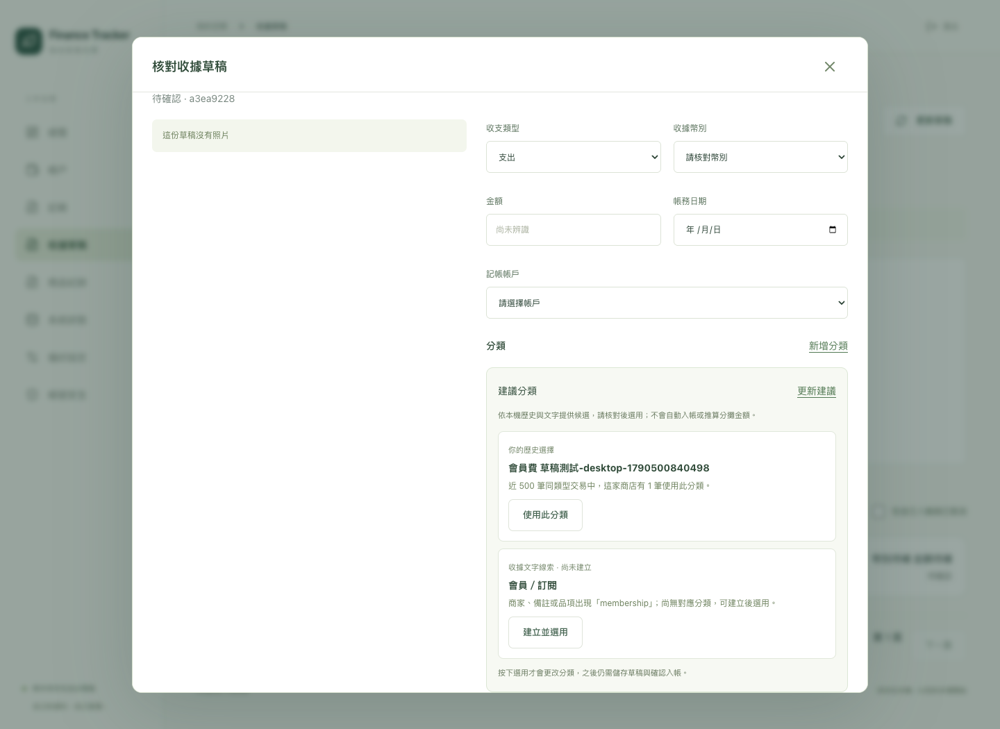
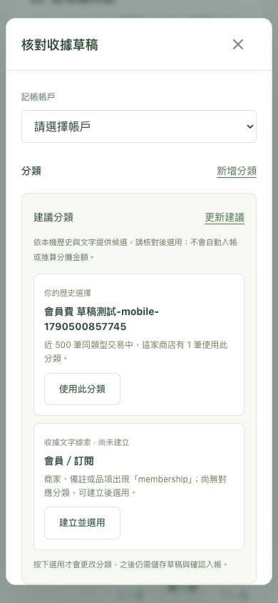

# 收據草稿分類建議

日期：2026-09-27。使用者要求每次有草稿時提供建議分類。本批在 Web 核對視窗提供可解釋的本機候選，沒有替正式收據選分類或建立交易。

## 交付

- 每次開啟可編輯草稿，顯示最多三個分類與理由。優先採同 owner、同商家、同收入／支出類型的近期已入帳紀錄；接著依商家、備註、最新有效核對品名或原始解析品名的中英關鍵字提示。商家 NFKC／空白／大小寫正規化後完整比對，僅看最近 500 筆同類型交易，不宣稱完整歷史統計。
- 現有分類可「使用此分類」，新名稱可「建立並選用」，先允許改名／指定上層；取消保留原表單。候選不自動選用；仍要儲存草稿、確認入帳。資訊不足時只提供明示的常用／現有選項，不假裝精準推論。
- 分攤必須先指定目標列，套用只改該列分類，金額不變。修改商家／備註或保存品項後更新，重新取得建議不覆蓋人工分類。舊前端請求會取消，回應須符合目前 request key。
- 新增唯讀預覽 API，沿用 owner、登入、CSRF、Origin 與 expected_revision；已確認／取消草稿拒絕建議。OpenAPI 與前端契約同步產生。schema 保持 `0006_products`，無新依賴／遷移／模型請求。

## 驗證

所有資料為合成，使用 PostgreSQL `finance_test` 與隔離 Chrome context；沒有使用正式網站登入 Cookie。

- `scripts/check-backend.sh`：Ruff、格式、mypy 通過；101 項測試通過，含既有一致備份及隔離還原；Alembic check 沒有模型變更。
- 7 項分類建議 PostgreSQL 測試：會員新分類、既有子分類、全半形／英文邊界、收支類型、封存排除、owner／auth／CSRF／Origin、過期／取消草稿拒絕、資料筆數／餘額／原始草稿不變。
- 歷史測試涵蓋同店頻率排序、更正後只採目前分錄、作廢排除、其他商家不誤算、同交易重複分類只計一次、不建議金額。品項測試涵蓋原始 Membership、人工改為牛奶、明確清空、草稿改版後舊核對不覆蓋新版。
- 前端 9 項單元測試、TypeScript／Vite build 通過。沿用既有 bundle size 提示。
- Chrome 桌面／手機尺寸 8 項 E2E 通過。分類案例涵蓋模擬 503 後可手動選擇、重試恢復、建議名稱預填／取消／改名建立、確認合成交易後同店新草稿顯示歷史、未點選仍留白、更新不覆蓋人工分類、分攤明確指定列且其他分類與金額不變。既有收據、品項、商品搜尋、視窗關閉與記帳測試一併通過。
- 初次 E2E 手機失敗原因是新增合成草稿後，既有取消測試以空商家定位到兩筆；改為唯一合成商家後完整 8 項重跑通過（39.3 秒）。沒有為測試改正式資料。
- 人工檢視桌面／手機截圖：候選理由與長名稱換行、按鈕可見、沒有水平溢出；實際 iPhone Safari 仍未驗。

## 範圍與後續

這是有限關鍵字與歷史參考，沒有自由語意模型推論、商家別名合併、自訂規則、自動分類／標籤、Bot 建議卡片或自動拆分金額。分類管理改名／封存及完整 Phase 1／2 其餘需求仍保留原待辦。

## 本機部署

Docker arm64 API／Web 映像建置成功。取得既有自動恢復維護鎖後，暫停 Web／worker／capture bridge；透過原備份服務建立並驗證 `9cc5105a-3ed5-4b6d-a269-e01f1b04b75d`（既有正式備份掛載 `/backups`，schema `0006_products`）。重建 API／worker／bridge／Web，沒有重建 DB 或執行 migration。

部署前後唯讀比對 20 張業務表的筆數與完整資料指紋：帳本設定、帳戶／分類／帳務科目、交易／分錄／分攤、匯率／報表、收據／附件／連結、草稿／解析／品項核對、商品／別名全部一致；指紋與原始資料不入 Git。服務啟動成功後移除維護標記，恢復自動啟動保護。

`http://localhost:8080/api/health/ready` 回傳 ready，首頁提供 `index-Cb-83w7C.js` 與 `index-D3HSZObP.css`；API／Web／DB healthy，worker／bridge running。後兩者沒有 Docker healthcheck，不能把 running 當成新一輪 Telegram 實機驗收。

保留使用者目前開啟的未儲存草稿與登入，不操作正式分類、收據確認或重新整理。實際選用由使用者儲存現有草稿並重新整理後進行；功能寫入的證據皆來自上述隔離合成測試。
