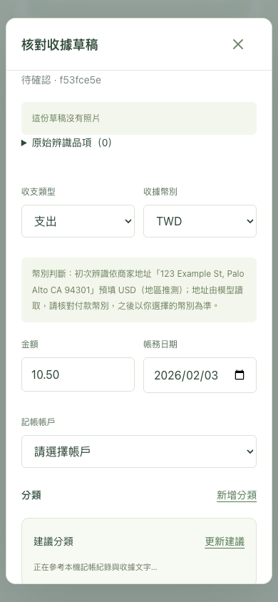

# 收據幣別：貨幣文字與地址線索

日期：2026-09-27。依使用者要求擴充 Telegram／Web 的草稿幣別辨識，保留人工核對與確認入帳。DB schema 保持 `0006_products`。

## 行為

- 提示版本 3／解析 JSON 版本 2 新增 currency_text 與 merchant_address；原始模型幣別、引文與地址保存於解析歷程。明確貨幣文字優先，其次是支援的美國／台灣地址格式；語言、品牌、裸 `$`、所選帳戶不作獨立證據。
- 多幣別衝突及不支援幣別保留待選；文字草稿不接受原始文字不存在的模型引文。照片文字仍由同一模型讀取，不是獨立 OCR 驗證，可能誤讀或捏造。
- Telegram 卡片與 Web 幣別選單旁顯示初次判斷理由；地址推論明示「地區推測」。手動改幣別保存後不被重新套用，也不換算金額。確認仍核對提醒及帳戶幣別，不自動過帳。
- 版本 1／2 排隊工作沿用原策略，版本 3 只用於新工作／明確重試；舊草稿與已入帳資料不批次改寫。程式、型別契約與基線文件一起更新，沒有依賴或模型更換。

## 本機模型實測

使用已安裝的 `qwen3-vl:8b-instruct`，8 張程式產生的合成收據，各辨識一次；沒有使用正式照片、呼叫雲端或發送 Telegram 訊息。命令：

```sh
backend/.venv/bin/python scripts/evaluate-local-ai.py --fixtures backend/tests/fixtures/currency-eval.json --output docs/verification/currency-eval-v3.json
```

| 合成情境 | 原始模型 currency | 最終草稿預填 | 依據 |
|---|---|---|---|
| 明確 US$ | USD | USD | 貨幣文字 |
| 美國城市／州碼／ZIP、裸 $ | USD（不符要求保留 null） | USD | 地址推測 |
| 台灣縣市／路／門牌、裸 $ | null | TWD | 地址推測 |
| 加拿大英文收據、裸 $ | USD（誤猜） | 留白 | 資訊不足 |
| 澳洲英文收據、裸 $ | AUD（推測而非明載） | 留白 | 模型提出非支援幣別 |
| 只有英文及 $ | USD（誤猜） | 留白 | 資訊不足 |
| 明確 NT$ | NT$（非要求 ISO 代碼） | TWD | 貨幣文字 |
| USD／TWD 同列 | USD（單一模型值不代表可採用） | 留白 | 引文含衝突幣別 |

最終預填幣別符合 8 / 8 案例預期；**嚴格原始欄位／判斷來源合計僅 3 / 8 案例通過，腳本 exit 1**。其中澳洲預填同為 null，但原因落在 unsupported 而非預設 unknown；原始模型另外存在推測幣別與格式錯誤。完整失敗細節保留在 [currency-eval-v3.json](currency-eval-v3.json)，不把應用層修正宣稱成模型完全正確。單次耗時 11.38–25.37 秒，未達成多樣本 p95 <15 秒驗收，也不代表各類真實拍攝地址都能正確讀取。

## 自動化驗證

相關 PostgreSQL／Telegram 回歸 76 項通過。包括 USD／TWD 文字、全半形、地址格式、英文／中文／裸 $、加拿大／澳洲、不同幣別衝突、文字模式捏造引文、原始模型不支援幣別、舊提示版本、手動更改、提醒未核對不可入帳、重送只過帳一次、Telegram 改選及舊 callback 防護。

- 完整 `scripts/check-backend.sh` 通過：Ruff／格式／mypy、132 項 PostgreSQL 測試與備份隔離還原、Alembic 模型一致性、OpenAPI 產生。原有 Starlette／httpx 棄用提示保留，未更換依賴。
- 前端型別契約同步，9 項單元測試、TypeScript／Vite build 通過；既有 bundle size 提示保留。
- 8 項桌面／手機尺寸 Chrome E2E 通過（34.7 秒），使用隔離 Cookie 與 `finance_test`。新增合成已辨識草稿，驗證初次 USD／地區推測／地址可見，改成 TWD 後金額保持 10.50，保存並重開仍為 TWD，初次理由不冒充目前選擇。既有分類建議、品項、搜尋、收據、記帳與視窗操作一併通過。
- 人工檢視手機尺寸截圖：幣別提示換行正常、關閉按鈕可見。真實 iPhone Safari 與真實 Bot 傳新收據的操作仍待使用者驗收；沒有替使用者送訊息或改正式草稿。



## 本機部署

Docker arm64 API／Web 映像建置成功。取得自動啟動維護鎖、暫停 Web／worker／bridge 後，使用既有備份服務建立及驗證 `/backups/422d1b0d-45c2-472b-b7b7-c6b76da2b2d7`（正式備份掛載，schema `0006_products`）。更新 API／worker／bridge／Web，DB 容器保留、未執行 migration。

部署前後比對 20 張業務表的筆數與完整內容指紋：帳務、帳戶／分類、收據／附件／連結、草稿／解析／品項與商品等全部一致；沒有改正式記帳資料。成功後解除維護標記、恢復自動啟動。沒有重新整理使用者的正式頁面、改登入或代按重新辨識；測試 API／worker／Vite 及測試 PostgreSQL 已停止。

正式 API 唯讀確認 prompt_version=3、parse_schema_version=2；ready endpoint 正常，首頁提供 `index-C7HT1uxY.js`／`index-D3HSZObP.css`。API／Web／DB healthy，worker／bridge running（沒有 healthcheck，不冒充 Telegram 實機驗收）。
