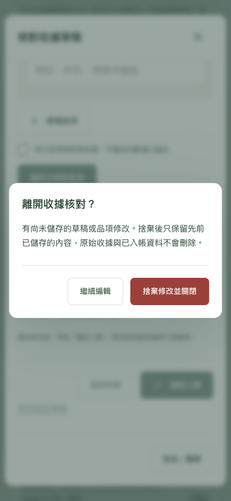
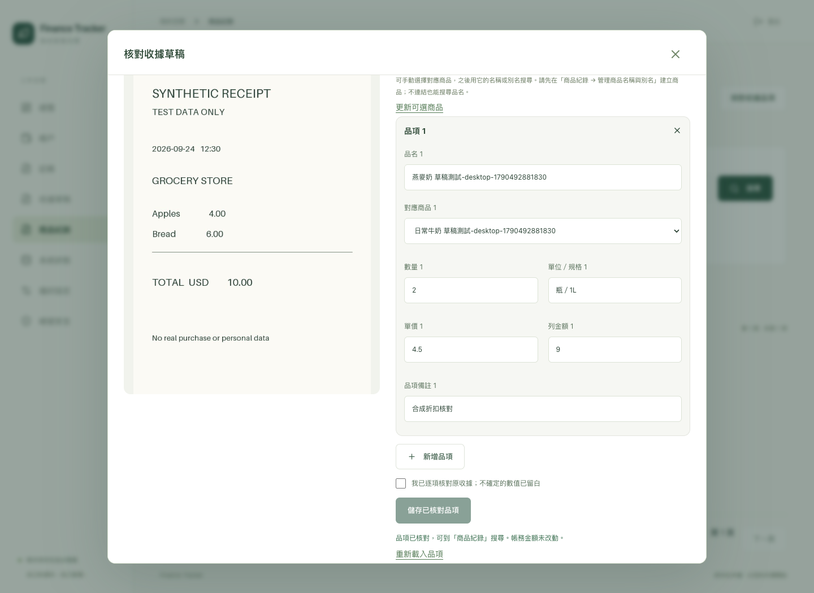

# 收據核對視窗關閉修正

日期：2026-09-27。使用者回報按鈕操作後視窗不關閉，並指出主要發生於收據草稿／品項核對。

## 問題與修正

- 草稿「確認入帳」「確定取消草稿」原本成功後只更新視窗內容。現在成功即關閉，結果提示留在列表；失敗仍保留視窗與輸入。儲存草稿／品項仍留在核對流程，底部新增「完成／關閉」。
- 有未儲存修改時，原本依賴 `window.confirm`。確認框被嵌入式瀏覽器阻擋或無法互動時，使用者無法選擇離開。改用網頁內的 ConfirmDialog：繼續編輯、捨棄修改並關閉；Esc 只取消最上層確認，焦點回到原控制項。草稿／品項重新載入與商品切換也使用同一元件，不再依賴 JS confirm。
- 長收據捲動後關閉圖示會離開畫面。共用視窗標題固定於上緣，關閉按鈕至少 44 × 44px；草稿另有底部關閉入口。
- 原本 fetch 沒有 deadline，HTTP 標頭或 response body 卡住會令表單 busy 和關閉按鈕無限鎖定。現在一般請求最多等待 30 秒，圖片上傳／檔案下載 120 秒；涵蓋 CSRF 初始化與 refresh 共用請求。逾時保留輸入、解除 busy、允許關閉，提示先重新載入確認結果；不自動重送寫入，也不宣稱中止等待等於伺服器已取消。
- 品項核對 checkbox 勾選後再取消，不再讓未改動的表單永遠維持 dirty；重新載入草稿即使 revision 相同，也重建品項編輯狀態。修正 dialog cleanup 讀取已清空 ref 的問題，改保存實際節點。

本次只修改前端與操作文件，不改 API contract、schema、帳務或原始收據。Phase 1／2／5 原進度維持，不標記新功能完成。

## 驗證

使用 disposable PostgreSQL `finance_test`、合成帳戶與照片，正式帳本沒有新增／更改交易或品項。

- 前端 **9 項單元測試通過**：既有 CSRF singleflight、refresh rotation、網路失敗，加上未回 headers、未完成 body、CSRF timeout 後重試、refresh timeout 釋放所有等待者、圖片上傳較長 deadline 且不自行重送。
- TypeScript／Vite build 通過；沿用既有依賴與 lockfile，既有 bundle size 提示保留。
- Chrome **8 項桌面／手機尺寸 E2E 全部通過**。擴充既有流程以免增加登入次數觸及限流；每次只重建合成測試資料，不改正式登入限制。
- 明確將 `window.confirm` 模擬為被拒絕，仍可透過頁內確認保留／捨棄修改、Esc 返回編輯、重新開啟只見已儲存內容。品項重新載入能回到先前版本；checkbox 勾選再取消可正常關閉。
- 攔住品項 PUT、推進 browser clock 超過 30 秒，確認錯誤提示、原輸入保留、關閉重新啟用；解除模擬後由使用者重試可成功。確認入帳／取消均自動關閉；入帳一次、品項修改後餘額不變。
- 帳戶 X／取消／Esc、交易內新增分類的巢狀 Esc、附件 X／Esc／完成、商品切換繼續編輯均通過。捲到品項區時關閉按鈕仍在 viewport，頁面無水平溢出。
- 人工檢視手機離開確認及桌面固定關閉按鈕截圖。Chrome 手機尺寸不能替代實際 iPhone Safari。

## 部署

- Docker arm64 前端映像建置成功，只重建 `web`，未重啟 API／worker／capture bridge／資料庫，沒有 migration。`web`、`api`、`db` healthy；worker、capture bridge running。
- `http://localhost:8080/` 回傳新資源 `index-D4pV6cdO.js`、`index-qByUoB0M.css`，重新整理後登入頁正常呈現。正式帳本的已登入核對操作仍由使用者重新登入後確認；上述完整核對測試是在隔離的 Chrome 測試 context 執行。
- 初期在共用 IAB profile 的 `localhost:5173` 登入合成帳號，因 Cookie 不依 port 隔離，影響 `localhost:8080` 原登入狀態。已關閉測試分頁、向使用者說明需要重新登入，並在 AGENTS.md 記錄測試 context 隔離要求；未更改正式帳密或帳本資料。
