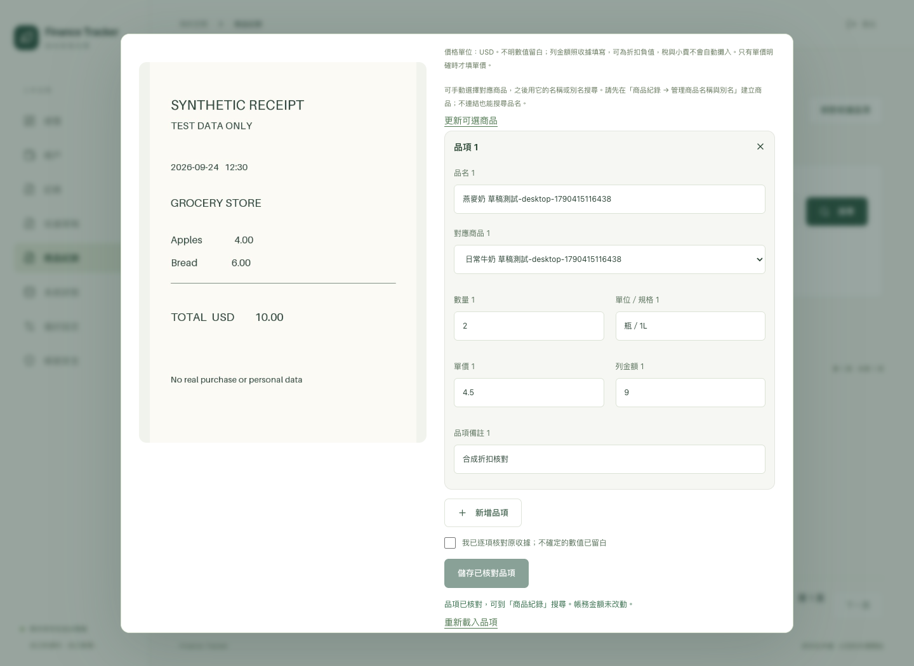
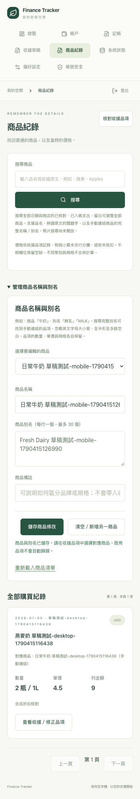

# 人工商品名稱／別名 → 收據連結 → 跨語購買查詢

日期：2026-09-26。延續使用者要求的商品核對／歷史搜尋，交付 D5-01 / D5-03 / D5-04 的下一個人工可用子集。

## 交付範圍

- Web「商品紀錄 → 管理商品名稱與別名」建立／修改商品名稱、最多 30 個別名及管理備註；先建立商品，再在核對品項中明確選擇對應商品。
- 名稱／別名以 NFKC、空白收斂、casefold 正規化，同 owner 唯一，canonical name 也佔用 key。搜尋完整名稱／別名，或原有品名／原文的 literal substring。Web / Telegram 共用查詢，結果顯示手動連結的商品名稱。
- `EXISTS` 比對別名，不因多名稱命中而重複計算購買；僅採最新且同時符合 draft / transaction revision 的已核對、已入帳支出。
- 連結／解除沿用 append-only review，確認入帳保存連結；原始辨識、原收據名稱、規格、價格與 financial postings 不改寫。商品設定更新不批次分類舊收據。
- 建立有 Idempotency-Key、修改有 revision 衝突保護；所有寫入取得 maintenance transaction / BookSettings lock，API 與複合 FK 同時限制 owner。
- 靜態遷移 `0006_products` 新增 products / product_aliases、receipt_items.product_id 空欄位；更新 schema gate、OpenAPI / types、備份 counts 與指紋，保留舊版還原支援。沒有依賴或模型更換。

## 自動與畫面驗證

使用獨立 PostgreSQL 16 `finance_test` 與合成照片、帳戶、Bot 事件，沒有以正式帳本作測試資料。

- 完整後端 **94 項通過**；Ruff / format、mypy、Alembic drift、OpenAPI 產生通過。新增 9 個案例覆蓋人工連結、入帳前排除、跨語／全半形／大小寫／空白、完整別名限制、同品項多路命中去重、更名與移除別名、解除連結不復活舊 review、原始值／NULL／規格／餘額不變、Telegram 共用查詢、冪等與衝突回滾、過期 revision、非法名稱／正規化膨脹、owner 隔離及 CSRF。
- 真實 `pg_dump` / `pg_restore` 演練擴充至帶有商品、別名及連結品項的備份；還原後原始解析、核對狀態與連結相同，未入帳草稿不增加支出。
- 額外在 disposable DB 回到 `0005_items` 生成舊版備份，再升級 head，比對購買查詢結果完全一致；新版程式將該舊備份實際還原至 `finance_restore_*`，保留舊 schema 和原品項。沒有降版正式資料庫。
- 前端 **4 項單元測試**通過，TypeScript / Vite 與 Docker arm64 API / Web build 通過。既有 bundle size 與 Starlette test client deprecation 警告保留，未換主要依賴。
- Chrome **8 項桌面／手機尺寸 E2E 全部通過**。擴充既有收據測試：UI 建商品別名 → HEIC 草稿 → 明細手動連結 → 保存、重新載入、確認一次 → 英文別名搜尋 → 修正單價／品名 → 修改別名 → 舊別名不再命中、新別名命中；餘額 50 → 40，後續品項更正仍 40。頁面／dialog 無水平溢出。
- 首次瀏覽器執行發現 native select 的精確 label locator 不適用，改用有名稱的 combobox role；檢視截圖後補上別名 textarea 排版，再重跑完整 8 項通過。已人工檢視桌面核對與手機商品管理截圖。

## 本機部署

取得 autostart lock 並建立 maintenance 標記，暫停 Web / worker / bridge，舊 API 建立及驗證 `0005_items` 備份；停止 API、套用 `0006_products`、啟動新版 API / worker，再建新版備份。完成後啟動 bridge / Web，移除 maintenance 標記，登入／喚醒恢復機制維持運作。

升級前後 accounts、transactions、journal_entries、postings、transaction_splits、receipts、receipt_attachments、attachments、capture_drafts、receipt_parse_attempts、receipt_item_reviews、receipt_items **12 表筆數與既有欄位內容雜湊相同**。品項比對排除此次新增的 nullable product_id；JSONB 排序一致後雜湊。當時已有 3 筆交易、10 份草稿、12 次辨識、2 個核對版本及 10 列品項，全數保留。未代替使用者核對或連結任何真實品項，沒有主動送測試 Telegram 訊息。

備份位置：升級前 `data/backups/8ef5b274-271e-4c88-b4bf-0b476981a4cf`，升級後 `data/backups/0749dea9-9f4e-4838-8b4a-02b38e166c4e`，均完成 manifest／檔案驗證。實際 restore drill 使用合成資料，沒有複製正式帳本至測試 DB。備份、真實照片與機密不進 Git。

部署後 API / DB / Web healthy，worker / capture-bridge running，bridge 心跳在 60 秒內。正式 localhost:8080 頁面重新整理並開啟「商品紀錄」，確認「管理商品名稱與別名」及空白商品建立表單可載入；既有未完成核對提醒仍顯示，未送出表單。

## 保留待辦

商品刪除／合併、自動同義詞、備註混合檢索、中文 trigram、向量／照片查詢、單位規格換算、獨立人工價格、統計比價與匯出仍未交付。商品備註只作管理說明，不參與搜尋。名稱相同不代表容量、品牌、稅基或幣別相同；不據此計算平均價格或退款淨額。

大量資料 p95、實際 iPhone Safari 與真實 Telegram 別名查詢仍待使用者實機驗收；自動測試的 Telegram outbox 與 Chrome 手機尺寸不能替代。D5-01 / D5-03 / D5-04 保持 DOING，完整 D5-05 尚未完成。
