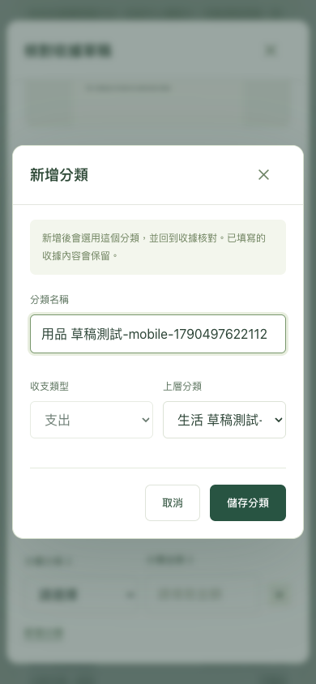
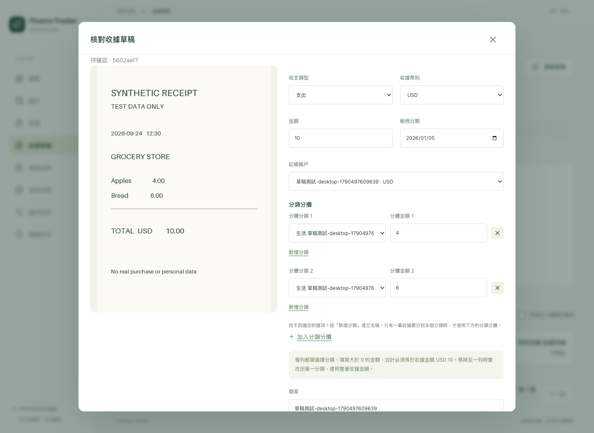

# 收據草稿新增分類與分攤

日期：2026-09-27。使用者回報「加入分類」無法正常使用，截圖顯示分攤列未選分類；唯讀檢視正式網頁確認當時收據只有既有分類選單，沒有建立新分類的入口。

## 修正

- 收據草稿提供「新增分類」，單一分類與各分攤列均可直接建立、選用主／子分類。建立成功即關閉分類視窗，原收據的金額、商家等未儲存內容保留；分類選擇仍需保存草稿。
- 沿用既有 `/categories` API、owner／CSRF／Idempotency-Key 與兩層分類規則。抽出共用 CategoryForm、Modal 及提交 key hook，記帳與收據不各自維護分類寫入流程。新增失敗保留輸入，可明確重試；取消／Esc 只關閉最上層視窗。
- 收據內新增分類固定為目前收入／支出類型；可選的上層只含同類型、未封存主分類。分類選項顯示「主分類 → 子分類」，無可用分類時明示新增入口。
- 區分「新增分類」與「加入分類分攤」用途。新分攤金額留白待填，不預填無法入帳的 0；顯示每列正金額與合計規則。刪除分攤至剩一列會保留該分類、回到整筆收據金額，畫面事先說明行為。
- 不更動後端 contract、schema、Decimal 帳務驗證或 AI 原始結果；未替使用者建立正式分類或修改收據。Phase 1／2 其餘待辦保持原狀。

## 驗證

使用隔離 Chrome context、合成資料與 PostgreSQL `finance_test`，沒有使用正式網頁的登入 Cookie。

- 9 項前端單元測試通過；TypeScript／Vite build 通過，既有 bundle size 提示保留。
- 8 項 Chrome 桌面／手機尺寸 E2E 通過，涵蓋既有記帳／附件／視窗關閉流程。
- 收據內建立支出／收入分類並立即選用；切換收支類型不混用分類。新增子分類並選入指定分攤列；取消／Esc 保留原金額與商家。
- 模擬分類 POST 回傳 503：錯誤可見、名稱保留，重試後僅一個分類。建立分類不會提交父層草稿表單；既有未完成分攤不阻擋子視窗建立分類。
- 分攤新增／刪除／儲存／重新開啟後資料正確；10 元合成收據以 4 元與 6 元記入兩個分類，僅建立一筆交易，帳戶餘額 50 → 40。API 回傳列順序沒有契約保證，測試核對分類／金額配對及列數，不假定順序。
- 人工檢視手機新增分類與桌面分攤截圖；頁面與視窗無水平溢出。實際 iPhone Safari 仍待實機驗收。

## 本機部署

Docker arm64 前端建置成功，只重建 `web` 並確認 healthy；API／worker／bridge／DB 未重啟、沒有 migration。`http://localhost:8080/` 回傳新版 `index-hguWQcnR.js` 與 `index-6iKTuZEr.css`，ready endpoint 正常。

保留使用者目前開啟的未儲存草稿，不操作其重新整理、分類或入帳；告知先儲存草稿再重新整理取得新版。正式帳本的新分類操作留待使用者自行選擇名稱；功能操作證據來自上方合成測試。
