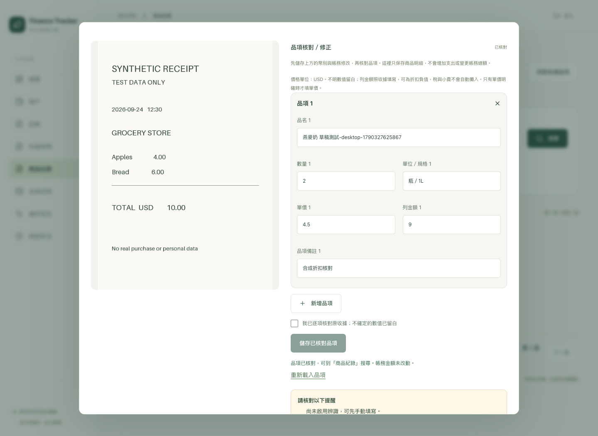
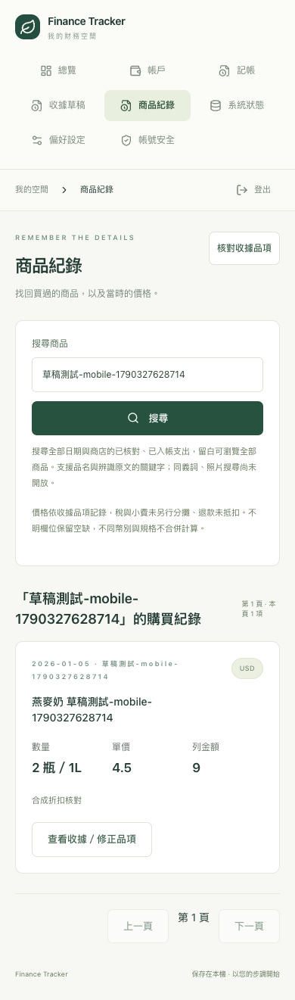

# 品項核對／修正 → 歷史商品搜尋

日期：2026-09-25。依使用者指定，提前交付 D5-01 / D5-03 / D5-04 的可用子集，延續 D2-03 草稿核對。

## 已交付

- Web 逐項核對：增刪、修正名稱／數量／單價／列金額／單位規格／備註。先保存帳務欄位，再保存核對品項；未儲存的品項阻止關閉誤丟及直接入帳。桌面原圖隨捲動保持可見。
- 原始 AI 結果不改寫；人工修正採 append-only review / item rows，保存來源解析快照與列連結。DB trigger 拒絕改寫歷史。數量／價格未知保留 NULL；零值仍顯示 0。
- 舊的已入帳收據可補核對；GET 不自動回填已確認商品。最新 review 同時吻合 draft revision 與 transaction revision 才納入搜尋。重辨識、帳務更正會要求再核對，取消／作廢來源不列入有效購買。
- 商品紀錄：跨所有日期／商店，修正品名與收據原文的字面 substring 搜尋、不分英文大小寫、跳脫 SQL wildcard、每頁 25 列；結果顯示日期／商店／數量／單價／列金額／幣別，可回原收據修正。
- Telegram `/lookup 商品關鍵字` 共用同一查詢，最多最近 5 項；照片查詢尚不支援並明確回覆，不誤建交易草稿。回覆由既有白名單與 durable outbox 處理。
- `0005_items` 新增兩表，不修改帳務資料；更新 schema gate、OpenAPI 與前端型別、備份 counts／內容指紋，保留舊版本備份驗證。

## 自動驗證

使用獨立 PostgreSQL 16 `finance_test`、合成圖片／文字／Bot ID，沒有對正式帳本新增或核對商品。

- **85 項後端測試通過**。本批 11 項新案例涵蓋修正與原文保存、入帳前不可查／確認後可查、一次入帳、入帳後更正不改餘額、刪除明細不復活舊版本、DB 歷史不可改寫、舊收據補核對、未知／零值、27 項分頁、literal `%_`、6 組非法輸入、同時提交僅一個成功、重新辨識與舊 revision 防護、帳務修訂／作廢、跨 owner／CSRF、Bot 唯讀查詢與照片意圖分離。
- 擴充既有備份還原演練：帶有 1 個核對版本、2 列品項的備份實際還原至隔離資料庫，核對原文、品項數與 reviewed 狀態保留；未入帳草稿未產生支出。完整回歸仍涵蓋財務、附件與其他還原路徑。
- Ruff / format、mypy、Alembic drift、OpenAPI 產生通過；前端 **4 項單元測試**、型別檢查及 Vite build 通過。
- Chrome **8 項桌面／手機尺寸 E2E 通過**。擴充原收據流程，驗證 HEIC 預覽 → 品項輸入 → 未儲存離開保護 → 保存與重新載入 → 確認一次 → 商品搜尋 → 開回原圖 → 修正單價／品名 → 再搜尋；現金餘額 50 → 40，品項修正後仍為 40，頁面與 dialog 無水平溢出。固定原圖的 CSS 調整後另重跑桌面／手機兩個完整收據流程均通過。
- 新流程初次獨立成新測試時，整套測試密集登入觸發原有每 15 分鐘限制；合併至原收據 E2E 後完整通過。未調高或繞過正式限流。

## 本機部署驗證

Docker arm64 API / Web build 通過。取得既有 autostart lock、建立 maintenance 標記後，暫停 Web / worker / bridge，使用舊 API 建立並驗證 `0004_capture` 備份，再停止 API、執行 `0005_items` 遷移，啟動新版服務。遷移後再次建立並驗證新版備份；成功後移除 maintenance 標記，恢復登入啟動與喚醒恢復機制。

升級前後 accounts、transactions、journal_entries、postings、transaction_splits、receipts、receipt_attachments、attachments、capture_drafts、receipt_parse_attempts **10 表的 row count 與整列內容雜湊完全一致**。正式資料仍為 2 筆交易、2 份草稿、4 次辨識；未代替使用者核對既有品項，沒有主動發送測試 Bot 訊息。新版 Web / API / DB 正常，worker / bridge 運行，bridge heartbeat 小於 60 秒。瀏覽器實際重新整理後已出現「商品紀錄」，能讀取「1 份已入帳收據尚待品項核對」提示。

升級前備份：`data/backups/6d8d0f3b-769b-483a-95fd-f9f83d34cd96`；升級後備份：`data/backups/671fe0c9-44ec-4314-975e-0e42e733c014`。此處只記識別路徑；備份內容與正式照片不進 Git。正式備份做 manifest／檔案驗證，實際還原演練使用上方合成隔離資料，未把正式資料複製到開發測試環境。

## 保留待辦

尚無商品主檔、別名／多語同義詞、備註混合搜尋、向量／照片搜尋、規格換算、跨幣比價、品項匯出與退款價格淨額。列金額依收據保存，稅與小費不另分攤。大量資料 p95、實際 iPhone Safari／Telegram 查詢仍待實機驗收；Chrome 手機尺寸與 fake Telegram 整合不能替代。此次沒有更換 AI 模型、提升 OCR 品質或改用雲端。D2-03 與 Phase 5 保持部分完成。
