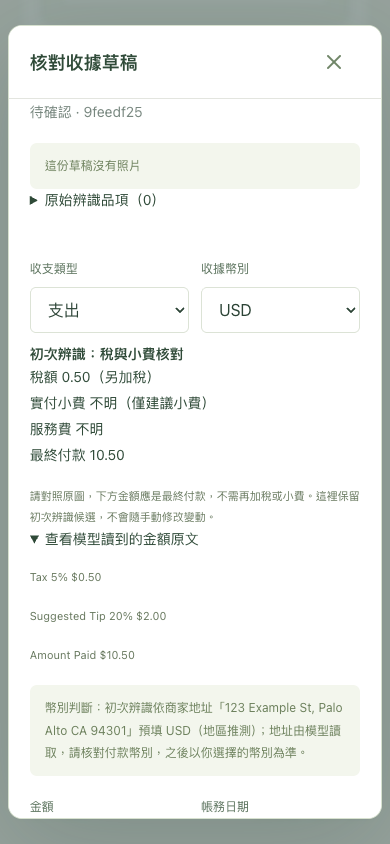

# 稅與小費辨識核對

日期：2026-09-27–28。依使用者要求加強 Telegram AI 收據辨識，Web 共用核對結果。本批 prompt_version=4／parse schema_version=3；DB schema 保持 `0006_products`。無新套件、模型、雲端或憑證。

## 行為與範圍

- 保存逐列金額原文：稅、實付小費、服務費、最終付款。稅率不是稅額，多稅列與稅合計避免重複；含稅小計不再加一次稅。
- 小費分 paid／blank／suggested_only／not_printed／unclear；未知不代填 0，明確零值保留。建議小費即使有金額也不當成實付。服務費獨立列示。
- 只有最終付款候選可預填草稿金額。小費前總額、空白小費後沒有最終付款、現金找零及預授權留待核對。不按稅率、小費比例或總額差額補值。
- 原始 parsed／parse attempts 不改寫；API 的 charge_review 只提供唯讀候選及提醒。人工修正 proposal.amount 後，候選保留初次值；確認僅用人工確認的最終金額，不另外加稅、小費或服務費。所有新結果仍有租約、revision 及 ledger service 防護。
- 圖片引文由同一模型讀取，可能看錯或捏造；不是獨立 OCR 證據。文字模式則要求引文存在原輸入。若新版工作未回傳新證據，保留相容的原始結果並明確提醒欠缺核對依據。
- 舊提示 1–3 與 schema 仍支援排隊工作；舊草稿、歷史交易不批次改寫。需要新版時，使用者明確選擇重新辨識；其可能取代先前人工修正。

## 本機模型：同組合成收據比較

使用既有 `qwen3-vl:8b-instruct`，八張乾淨合成圖片，每輪每張一次。固定 fixture 在 `backend/tests/fixtures/receipt-tax-tip-eval.json`；沒有使用正式收據、沒有發 Telegram 訊息、沒有外送雲端。

| 情境 | 舊提示 v3 | 最終提示 v4 與核對候選 |
|---|---|---|
| 稅率 8%、稅 4、實付小費 10、付款 64 | 金額欄位符合 | 全部符合 |
| 建議 15%／20%，實付 54 | 小費 null、付款 54 | 符合，標示僅建議小費 |
| 小費及最終付款欄空白，前段 Total 54 | **錯用 54 作最終付款** | 小費／最終付款 null，blank |
| 含稅小計 120、內含稅 5.71 | 金額欄位符合 | 符合，included，付款仍 120 |
| GST 2.50、PST 3.50、稅合計 6 | 金額欄位符合 | 稅 6，不重複成 12 |
| 稅 4、服務費 5、小費 3、付款 62 | 金額欄位符合 | 符合，服務費獨立 |
| 只有稅率 8.25% | 稅 null | 稅 null，不反推 |
| 零稅／零小費、付款 20、現金 50／找零 30 | 金額欄位符合 | 明確零值保留，付款 20 |

舊版原始欄位通過 **7 / 8**，exit 1，見 [tax-tip-v3-baseline.json](tax-tip-v3-baseline.json)。新提示首輪 **6 / 8**，exit 1：空白小費被標為 not_printed、零稅的原文列遭省略（核對候選為 null）；完整失敗保留 [tax-tip-v4-initial.json](tax-tip-v4-initial.json)。針對這兩點增加明確零值與空白欄示例及 schema 欄位說明後，以相同 fixture 重測，原始預期金額與核對狀態 **8 / 8**，exit 0，見 [tax-tip-v4-eval.json](tax-tip-v4-eval.json)。初版／最終 v4 都在本次未發布開發期間調整，不曾套用正式草稿。

最終 v4 單張 17.94–70.76 秒；測試期間亦執行開發檢查，非獨占機器的效能基準。仍未達既定 p95 <15 秒，也不保證真實照片、模糊／手寫小費與各式稅費版面。這是八個指定乾淨樣本的結果，不是全面準確率。

重跑：

```sh
backend/.venv/bin/python scripts/evaluate-local-ai.py --prompt-version 4 --fixtures backend/tests/fixtures/receipt-tax-tip-eval.json --output .tools/tax-tip-eval.json
```

## 自動化驗證

- 完整 `scripts/check-backend.sh` 通過：Ruff／格式／mypy、**162 項**測試（真實隔離 PostgreSQL、備份還原）、Alembic 一致性與 OpenAPI 產生。未使用正式帳本測試。原有 Starlette／httpx 棄用提示保留。
- 新增 30 項稅／小費案例，涵蓋百分比與部分數字不得當金額、多稅種／摘要／重複／衝突、含稅、服務費、小費狀態、非最終付款、捏造文字引文、明確零與極小 Decimal／超界合計、舊 provider schema、Telegram 候選與原始結果、過期租約／revision、手改金額再確認不加稅費。
- OpenAPI 與前端型別同步；**9 項**前端單元測試、TypeScript／Vite build 通過。原 bundle size 提示保留。
- **8 項** Chrome 桌面／手機尺寸 E2E 通過（36.8 秒），包括新稅額／建議小費／服務費未知／原文展開、無橫向溢出，以及原分類、品項、搜尋、收據與記帳流程。Cookie／API／資料庫與正式頁隔離。
- 已檢視兩種尺寸截圖：核對欄與原文可讀、關閉按鈕可見。真正 iPhone Safari、手寫小費照片、真實 Bot 新收據操作待使用者驗收；未代送訊息或改正式草稿。



## 本機部署

2026-09-28 Docker arm64 API／Web 映像建置成功。取得自動啟動維護鎖，暫停 Web／worker／bridge，使用現有備份服務建立且驗證 `/backups/17e81ea5-8726-4769-9f4e-2e56474b3c13`（schema `0006_products`，正式備份掛載）。更新 API／worker／bridge／Web；保留 DB 容器，無 migration。

部署前後 20 張業務表筆數與完整內容指紋一致，涵蓋帳務、帳戶／分類、收據／附件、草稿／解析／人工品項與商品等。成功解除維護標記、恢復自動啟動。沒有重整使用者正式頁、改登入、按重新辨識或變更正式草稿。

唯讀確認 API prompt_version=4、parse_schema_version=3；ready 正常，首頁提供 `index-BpnOHOP5.js`／`index-D3HSZObP.css`。API／Web／DB healthy，worker／bridge running（沒有 healthcheck，不冒充 Telegram 實機測試）。隔離測試 API／worker／Vite 與測試 PostgreSQL 已停止。
